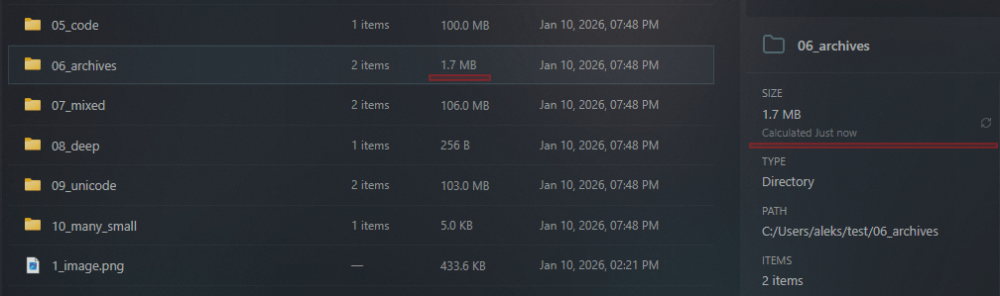

# Changelog

All notable changes to Sigma File Manager v2 will be documented in this file.

The format is based on [Keep a Changelog](https://keepachangelog.com/en/1.0.0/),
and this project adheres to [Semantic Versioning](https://semver.org/spec/v2.0.0.html).

---

## Unreleased

### Fixed

- Fixed visible console windows flickering on Windows in production builds when detecting available terminals and resolving executable paths (missing CREATE_NO_WINDOW flag on spawned processes);
- Fixed `open_with_default` showing a brief console window flash when opening files on Windows;

## [2.0.0-beta.1] - February 2026

Major usability and design improvements including keyboard navigation, new shortcuts, open in terminal, directory auto-refresh, drag and drop, and enhanced search and list views.

### Keyboard Navigation

Navigate files using the keyboard with full support for grid and list layouts and split view.

- Arrow keys for spatial navigation in grid view and sequential navigation in list view;
- Enter to open selected directory or file, Backspace to navigate back;
- Ctrl+Left / Ctrl+Right to switch focus between split view panes;
- Ctrl+T to open the current directory in a new tab;
- All navigation shortcuts are customizable in Settings > Shortcuts;

### Directory Auto-Refresh

The navigator view automatically refreshes when files are created, deleted, renamed, or modified in the current directory.

- File sizes update automatically when changed by external applications;
- Efficient file system watching with debouncing to avoid excessive refreshes;
- Smart diff-based updates only change affected items, preserving scroll position and selection;

### Drag and Drop

<video width="100%" mute autoplay loop controls src="./public/changelog/beta-1/drag-and-drop.mp4"></video>

You can now drag files and folders around to copy/move them with ease. Drag between panes, from or to search results lists, from or to external apps.

### Copy conflicts

Added modal window for easy copy/move conflict resolution.

### Auto Update

Added automatic checking for updates (can be controlled from settings).

### Home Banner Media Editor

Added editor for home page banner customization. You can now upload custom images and videos (both local and remote URL files are supported) 

### List View Enhancements

- Improved design and fixed little annoyances;
- Added column visibility customization: choose which columns to display;
- Added column sorting: click column headers to sort entries;
- Default navigator layout changed to list view;

### Global Search Improvements

- Updated layout and design with drag and drop support;
- Search is now available while drives are still being indexed;

### Open in Terminal

Open directories in your preferred terminal directly from the context menu.

- Automatic detection of installed terminals on Windows, macOS, and Linux;
- Windows Terminal shows all configured shell profiles with executable icons;
- Linux default terminal auto-detected and shown first;
- Includes normal and admin/elevated modes;
- Default shortcut: Alt+T;

### Localization

- Added Slovenian language (thanks to: @anderlli0053);

### UI / UX Improvements

- Added font selector: choose UI font from installed system fonts;
- Added "Create new" menu for quickly creating files or directories;
- Showing empty state view when navigating to empty directories;
- Status bar shows total items with hidden count when list is filtered;
- Newly created, copied, and moved items auto-scroll into view;
- Clipboard toolbar displayed once below panes instead of in each pane;
- Simplified rename modal design;
- Responsive toolbar icons that collapse into dropdown on small window sizes;
- Removed empty "Navigation" tab from settings;
- Renaming a directory now updates its path across all tabs, workspaces, favorites, tags, history, and frequent items;
- Deleting a file or directory now removes it from all stored lists and navigates affected tabs to home;
- Non-existent paths in favorites, tags, history, and frequent items are now auto-cleaned on startup;

### Bug Fixes

- Fixed global search indexing status not updating in real-time;
- Fixed split view pane not updating when its directory is deleted or renamed from the other pane;
- Fixed tabs loading with an error when their stored path no longer exists;
- Fixed system icons showing the same icon for all files of the same type instead of unique per-file icons;
- Fixed keyboard shortcuts not working in the second pane of split view;
- Fixed keyboard shortcuts stopping to work after page navigation;
- Fixed memory leak with filter keydown listeners not cleaned up on unmount;
- Linux: added support for default app retrieval in "open with" menu;

---

## [2.0.0-alpha.6] - January 2026

What's New window, Quick View, context menu enhancements, and new settings.

### What's New window

A changelog window that shows new features and improvements for each release.

- Automatically appears after updates (can be disabled);
- Browse through all releases;
- See detailed descriptions and screenshots for each feature;

### Quick View

Preview files without fully opening them using a lightweight preview window.

- Press `Space` or "Quick view" option in the context menu to quickly view files;
- Close instantly with `Space` or `Escape`.
- Supports images, videos, audio, text files, PDFs, and more;

<video width="100%" mute autoplay loop controls src="./public/changelog/alpha-6/quick-view.mp4"></video>

### Directory Size Calculation

- The size of directories is now auto calculated;
- You can see the total size of all directories, including all subdirectories and files, as soon as you open any directory;

### New Context Menu Options

#### Open With

- Choose which application to open a file with;
- Setup custom presets to open files in applications with flags;
- View all compatible applications for any file type;
- Set default applications for specific file types;

#### Shell Extensions

- Access Windows shell context menu items;
- Access third-party shell extensions (7-Zip, Git, etc.);

### New Settings

#### Drive Detection

- Focuses the app when removable drives are connected (can be disabled);
- Control Windows Explorer auto-open behavior for removable drives;

#### Filter on Typing

Start typing anywhere in the navigator to instantly filter items in the current directory;

#### Settings Search Shortcut

New keyboard shortcut for quick access to settings search;

#### User Statistics Data

- Added statistics settings section;
- On dahsboard page you can see, navigate, clear history, favorites, and frequently used items;

### Search Improvements

Improved global search with a hybrid indexed + direct search system for more reliable and up-to-date results.

- Searches now consistently take less than 1 second (~1 TB fully filled drive), no matter where the files are on your drives; 
- When you search your "priority paths" (the ones that you open often), you get results instantly and it finds the files even if they were just created and weren't indexed yet.

#### Priority paths include: 
- User directories: Downloads, Documents, Desktop, Pictures, Videos, Music;
- Favorites;
- Recently opened;
- Frequently used;
- Tagged;

---

## [2.0.0-alpha.5] - January 2026

File operations, global search, and shortcut customization.

### Global Search

Powerful full-disk search that indexes and searches files across all your drives. Features fuzzy matching to find files even with typos, automatic periodic re-indexing, priority indexing for frequently used directories, and optional parallel scanning for faster indexing.

### File Operations

Full file operation support with copy, move, and delete functionality including progress tracking. Also includes in-place file and folder renaming.

### Shortcut Editor

Customize all keyboard shortcuts in the app. View current bindings, detect conflicts, and reset to defaults.

### Navigator Enhancements

Added option to display native system icons for files and directories instead of minimalistic glyphs. Settings navigation tabs now stick to the page when scrolling.

---

## [2.0.0-alpha.4] - January 2026

Home page, visual effects, and user customization options.

### Home Page

A beautiful home page featuring an animated media banner, drive list, and quick access to common user directories like Documents, Downloads, Pictures, and more.

### Visual Effects

Customizable visual effects section in settings that adds blur, opacity, and noise effects to the app background. Supports different settings for each page.

### User Directories Editor

Customize your user directory cards with custom titles, icons, and paths. Personalize how your quick access directories appear on the home page.

### Banner Position Editor

Fine-tune the position of your home page banner backgrounds. Adjust zoom, horizontal and vertical positioning for the perfect look.

### Settings Improvements

- Settings search now works in any language, not just the current one;
- The app will restore the last visited settings tab on reload instead of opening the first one every time;

---

## [2.0.0-alpha.3] - December 2025

Navigator view with tabs, workspaces, and a new design system.

### Navigator View

The core file browsing experience with a modern tab system supporting workspaces, a new window toolbar design with integrated controls, and dual-pane navigation for efficient file management.

### Video Thumbnails

Added preview thumbnails for video files in the navigator.

### Design System Migration

Migrated the app from Vuetify to Sigma-UI for a more spacious, modern design with improved code quality.

---

## [2.0.0-alpha.1] - January 2024

Complete rewrite using modern technologies.

### Tauri Migration

Sigma File Manager v2 has been rebuilt from the ground up using Vue 3 Composition API, TypeScript, and Tauri v2. App installation size reduced from 153 MB to just 4 MB on Windows. Installed app size reduced from 419 MB to 12 MB.

### Resizable Panes

Added resizable panes feature which lets you split the navigator view in half and work with 2 directories side by side.

### Initial Features

Basic file navigation with directory listing, window management with minimize, maximize, and close controls, and an initial settings page structure.
