# Changelog

## [2.2.0] - July 2026

**Summary:** System clipboard integration with other apps, box selection, linked split view, link handling, password-protected ZIP archives, native Properties on Windows, extension API expansions, Hebrew language support, and navigator polish.

- [New Features](#new-features)
  - [System Clipboard Integration](#system-clipboard-integration)
  - [Box Selection](#box-selection)
  - [Linked Split View](#linked-split-view)
  - [Link Handling](#link-handling)
  - [Native Properties Window](#native-properties-window)
  - [List View Column Resizing And Reordering](#list-view-column-resizing-and-reordering)
  - [Root Locations Address](#root-locations-address)
- [Extensions](#extensions)
  - [Extension APIs And Views](#extension-apis-and-views)
- [New Settings](#new-settings)
- [New Shortcuts](#new-shortcuts)
- [New Languages](#new-languages)
- [UX Improvements](#ux-improvements)
  - [Archive Extraction](#archive-extraction)
  - [Grid Sorting](#grid-sorting)
  - [Shell Extensions](#shell-extensions)
  - [Session Memory](#session-memory)
  - [Navigator Performance](#navigator-performance)
  - [Home Page And Context Menus](#home-page-and-context-menus)
- [UI Improvements](#ui-improvements)
- [Bug Fixes](#bug-fixes)

### New Features

#### System Clipboard Integration

Copy and paste files, folders, and images between Sigma File Manager and other apps through the system clipboard.

- **Cross-app file transfer**: copy or cut items in SFM and paste them into apps like File Explorer, or paste paths and files copied from other apps into the navigator with `Ctrl+V`;
- **Image paste**: paste images copied from browsers and other apps directly into a folder;
- **Conflict dialogs**: when pasted items already exist, choose `Rename` or `Merge`, and resolve individual file conflicts with Replace, Skip, Keep both, or Apply to all;
- **Clipboard toolbar**: optional toolbar preview for images and file paths copied in other apps;

Toolbar visibility can be controlled in `Settings > UI appearance > Clipboard`. Paste with `Ctrl+V` still works when the toolbar is hidden.

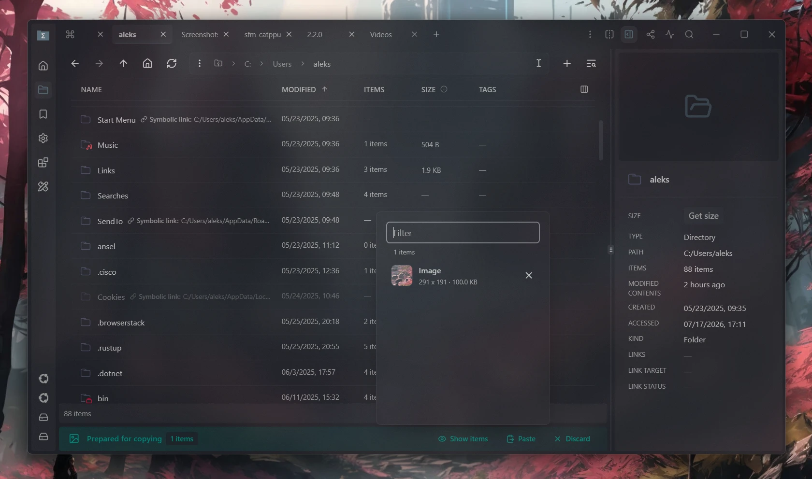

#### Box Selection

Drag on empty space in the navigator to select multiple items with a selection box.

- **Modifiers**: hold `Ctrl` or `Shift` to add to the current selection; hold `Alt` to invert;
- **Easier targeting**: optionally increase list padding and grid gaps for more room to start a drag;

Enable in `Settings > General > File view > Enable box selection`.

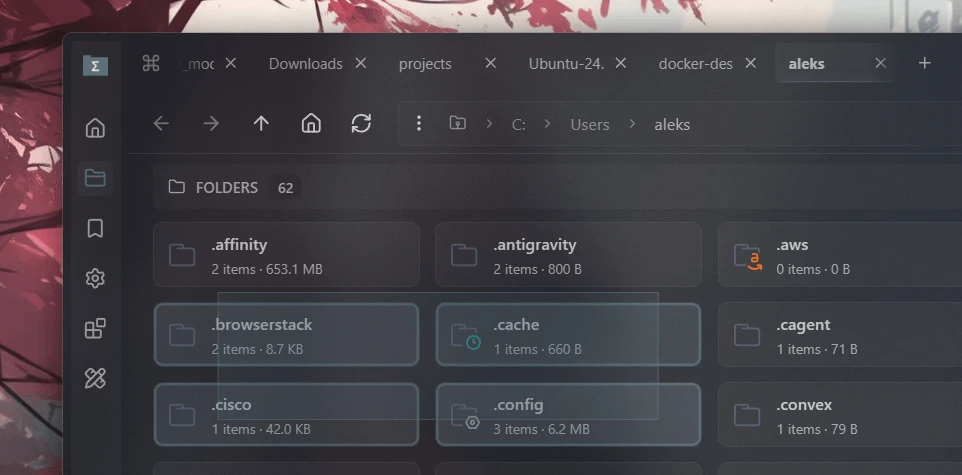

#### Linked Split View

New `Linked` split view mode for a simpler column-style workflow: clicking a folder in the first pane shows that folder's contents in the second pane.

The existing independent `Split` mode is unchanged. Choose the mode from the navigator options menu under `Split view mode`, or toggle split view with `Ctrl+S`.

The info panel icon was also updated so it is easier to tell apart from the split view icon.

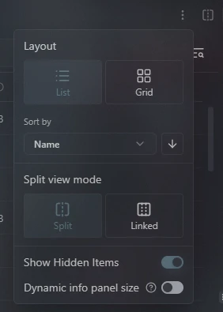

#### Link Handling

Create and inspect filesystem links from the navigator.

- **Create link**: create symbolic links, shortcuts, hard links, and junctions from the context menu (`Create link`);
- **Link columns**: optional list columns for Kind, Links, Link target, and Link status (`Valid`, `Broken`, `Unknown`, `Unsupported`);
- **Open behavior**: directory shortcuts and symlink folders navigate to their targets; other link targets open with the default app;

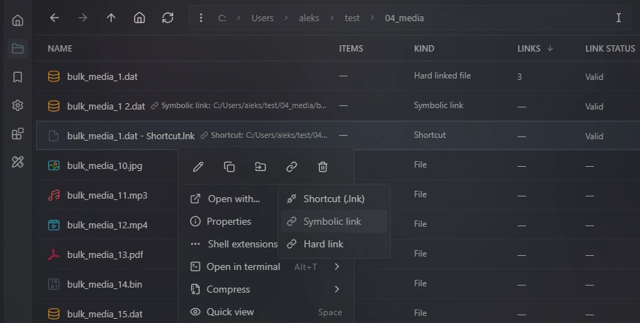

#### Native Properties Window

On Windows, open the native system Properties dialog for selected items from the context menu, actions menu, `Alt+Enter`, or `Alt` + double-click.

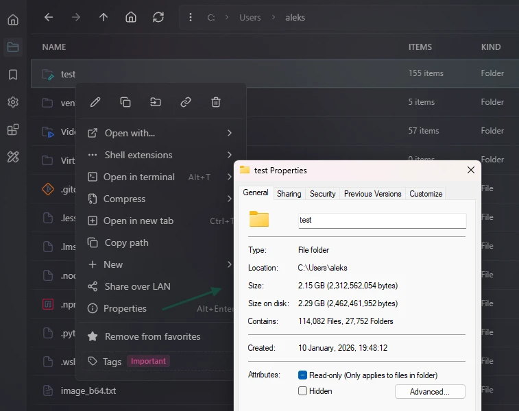

#### List View Column Resizing And Reordering

List view columns can be resized and reordered to match how you work.

- **Resize**: drag column edges to change widths;
- **Reorder and visibility**: manage order and visibility from the list header `Columns` popover;
- **Width options**: `Fill available width` and `Set minimum widths`;

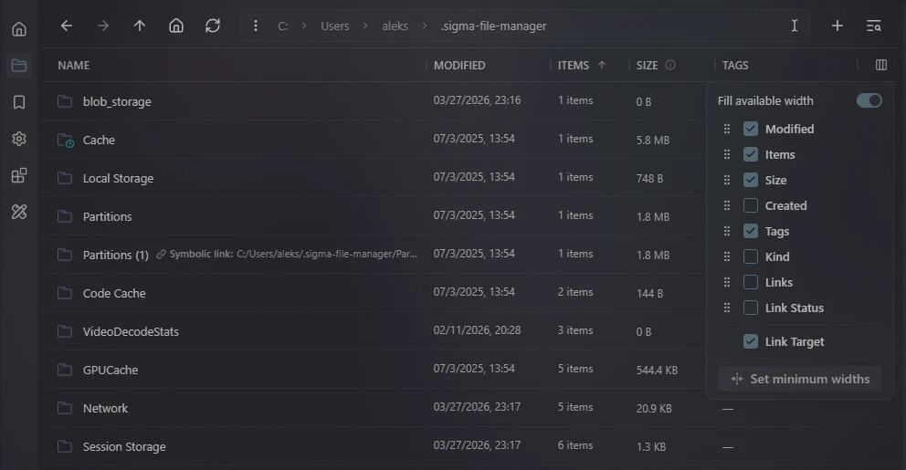

#### Root Locations Address

A root `Locations` address lists drives and virtual locations for faster switching.

- **Address bar**: go up from a drive root or open `Locations` from the address bar / address editor;
- **Favorites and tags**: Locations can be added to favorites and tagged like other directories;
- **Split view**: especially useful for switching drives between panes without leaving the navigator;

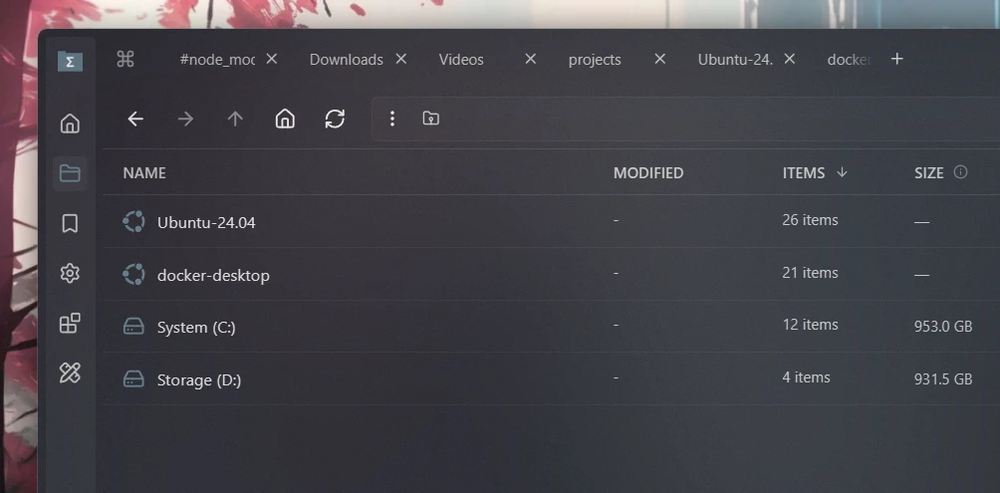

### Extensions

#### Extension APIs And Views

Extensions gain more host capabilities and UI building blocks.

- **Local binaries**: configure extension dependencies with auto setup or manually chosen local binaries (`Extensions > Dependencies`);
- **HTTP requests**: extensions can make HTTP requests to hosts allowed by their manifest;
- **View control**: extensions can apply navigator layout and sorting preferences (with the view permission);
- **Clipboard API**: extensions can read and write the clipboard (with permission);
- **List-detail view**: new extension UI pattern with a searchable list and a detail pane;

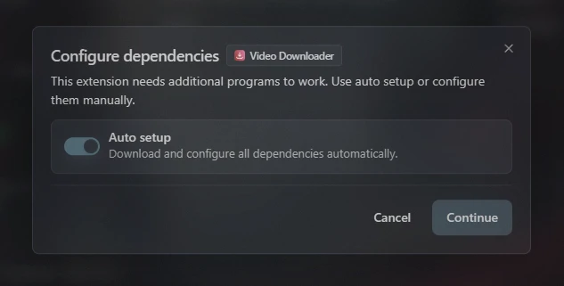

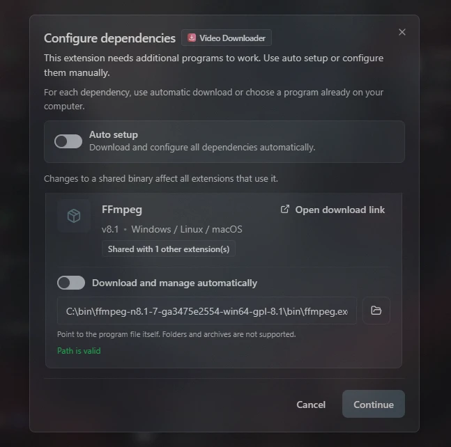

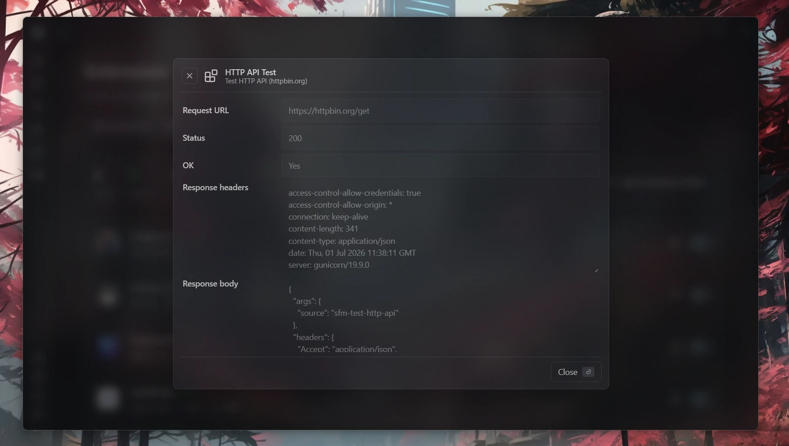

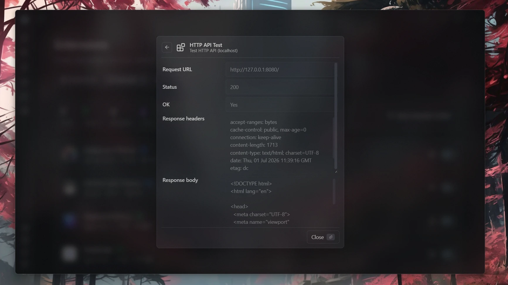

### New Settings

- **Enable box selection**: drag empty space to multi-select;
  `Settings > General > File view > Enable box selection`
- **Increase file view gaps**: add list padding and larger grid gaps for easier targeting;
  `Settings > General > File view > Increase file view gaps`
- **Keep Quick View window in memory**: keep Quick View loaded so it opens instantly (uses about 200 MB);
  `Settings > General > Performance > Keep Quick View window in memory`
- **Keep Print window in memory**: keep the Print window loaded so it opens instantly (uses about 200 MB);
  `Settings > General > Performance > Keep Print window in memory`
- **Clipboard toolbar for external images**: show the clipboard toolbar for images copied in other apps;
  `Settings > UI appearance > Clipboard`
- **Clipboard toolbar for external paths**: show the clipboard toolbar for file paths copied in other apps;
  `Settings > UI appearance > Clipboard`
- **Dynamic info panel size**: let the info panel size adapt, or turn this off by resizing manually;
  `Settings > UI appearance > Info panel > Dynamic info panel size`
- **Show full-size image in info panel preview**: show full-resolution images in the info panel;
  `Settings > UI appearance > Info panel > Show full-size image in info panel preview`
- **Mute video preview by default**: mute info panel video previews while browsing;
  `Settings > UI appearance > Info panel > Mute video preview by default`
- **Automatically play video previews**: autoplay videos in the info panel when selected;
  `Settings > UI appearance > Info panel > Automatically play video previews`

### New Shortcuts

- **Native Properties** (`Alt+Enter`): open the native Properties window for selected items on Windows;

### New Languages

- **Hebrew** (`עברית`): full translation with right-to-left layout support (`Settings > General > Language`);

### UX Improvements

#### Archive Extraction

ZIP extraction now supports encrypted archives and non-UTF-8 file names.

- **Password-protected ZIP**: enter an archive password when extraction requires it;
- **File name encoding**: choose encoding in `Archive extraction options`, with auto-detect preferred and grouped regional encodings as fallbacks;

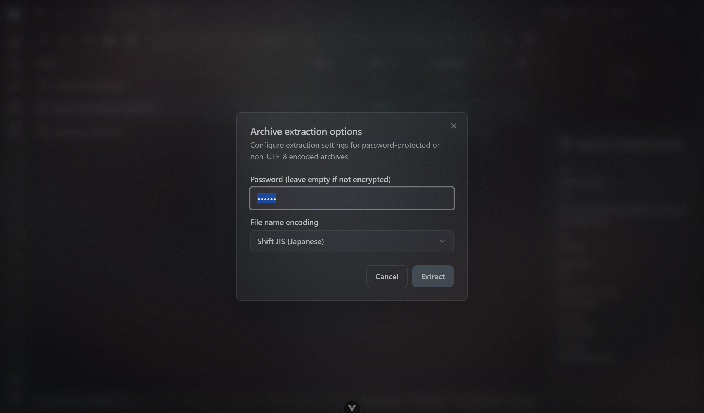

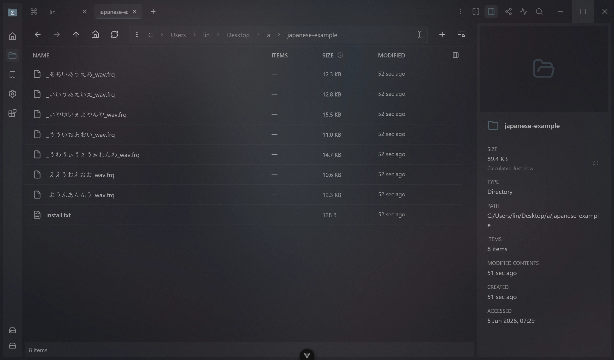

#### Grid Sorting

Grid layout now has its own sort controls in the navigator options menu.

- **Sort by**: Name, Items, Size, Modified, Created, Tags, Kind, Links, and Link status;
- **Direction**: ascending or descending, stored separately from list-view sorting;

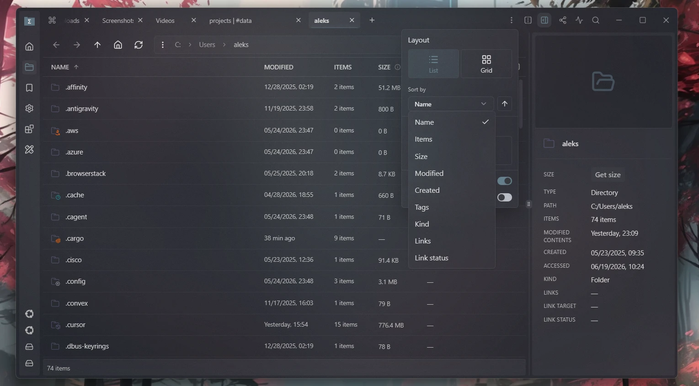

#### Shell Extensions

The context menu can load modern shell extension actions registered by other apps under `Shell extensions`.

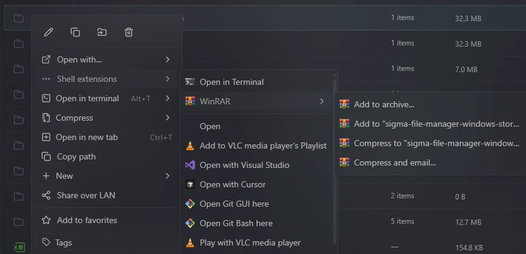

#### Session Memory

Scroll positions and active tabs are restored when you switch away from a page or pane and come back during the same session.

#### Navigator Performance

Browsing large folders and media is faster and uses less memory.

- **Cold loading**: faster first load when opening directories;
- **Icon loading**: custom and system icons appear with less delay;
- **List scrolling**: smoother list scrolling in large directories;
- **Media previews**: image, GIF, and video previews are more responsive and use less memory;
- **Indexing**: more stable global search indexing;

#### Home Page And Context Menus

- **Disconnect**: disconnect network or removable mounts from the context menu when supported;
- **Close all duplicates**: tab menu `Close all duplicates` now closes every duplicate path in the workspace, not only duplicates of the current tab;
- **Right-click clear**: right-clicking empty navigator background clears the current selection before opening the background menu;
- **Home actions**: home page context menus close after action clicks, `Open in new tab` opens the navigator, and new tabs scroll into view;
- **Window drag region**: on Linux-style title bars, the drag region extends across toolbar buttons for easier window moving;

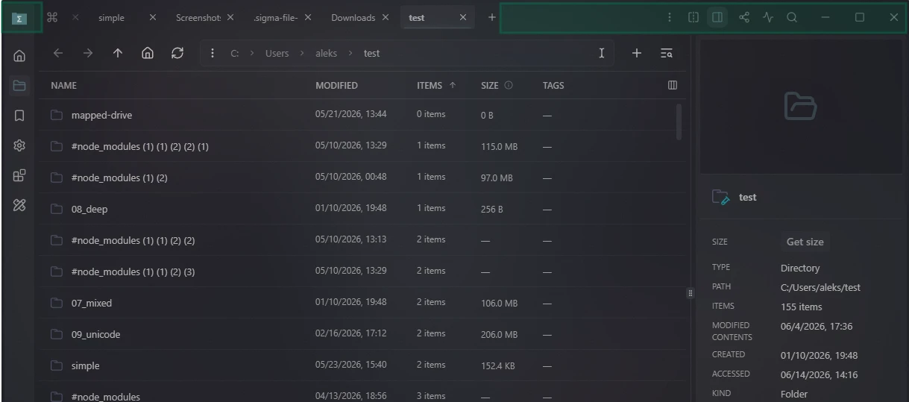

### UI Improvements

- **Active pane indicator**: clearer active pane marker in the status bar when split view is on;
- **Resizable info panel**: drag to resize the info panel width and the preview/details split;
- **Compact info panel**: denser property layout in the info panel;
- **Context menu actions**: `Edit card` is shown as an action button, with smaller action buttons overall;
- **Navigator styling**: improved adaptive layout, tab active-state styles in split view, and command palette extension view design;
- **RTL layout**: cleaner alignment for right-to-left languages;

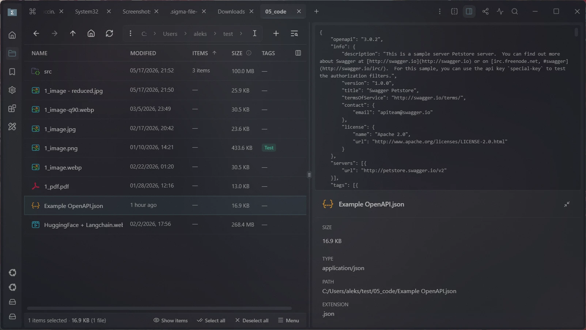

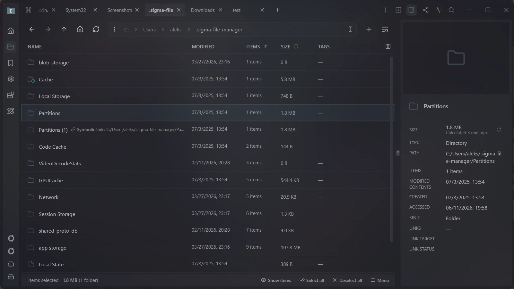

### Bug Fixes

- **Type-to-search**: fixed quick search not activating on non-Latin keyboard layouts;
- **Directory loading**: fixed entries reordering after a directory finishes loading;
- **Custom icons**: fixed custom icons loading with a noticeable delay;
- **Grid cards**: fixed grid layout cards changing size while loading;
- **Grid scrollbar**: fixed the grid scrollbar hiding behind sticky headers;
- **Quick selection**: fixed quick file selection sometimes opening the file;
- **Terminal shortcut**: fixed `Alt+T` opening a terminal for the current directory instead of the selected entry;
- **Open files**: fixed opened files launching from the wrong working directory;
- **SMB shares**: fixed inability to open files on SMB shares;
- **WSL paths**: fixed WSL host UNC path handling on Windows, including `//wsl.localhost` as a virtual distro list;
- **Default file manager**: kept the setting available for direct Windows installations; the Microsoft Store version now shows it as unavailable;
- **AppImage (Linux)**: fixed `Could not create default EGL display: EGL_BAD_PARAMETER`;
- **Extension install (Linux)**: fixed install failures for multi-file dist extensions;
- **Extension details**: fixed overview page alignment styles;
- **Device wake**: fixed the app getting stuck in a loading state after device wake-up;
- **Update notifications**: fixed update notifications appearing for unreleased versions;
- **RTL**: fixed right-to-left layout issues;
- **Translations**: fixed missing and incorrect translation strings;

---

## [2.1.0] - May 2026

**Summary:** Navigator performance improvements, generated thumbnails, extension themes, printing, file previews, new shortcuts, address editor improvements, status center redesign, and tab/navigation polish.

- [New Features](#new-features)
  - [Printing](#printing)
  - [File Drop To Tabs](#file-drop-to-tabs)
  - [File Preview In Info Panel](#file-preview-in-info-panel)
  - [Navigator List Columns](#navigator-list-columns)
- [Extensions](#extensions)
  - [App Themes From Extensions](#app-themes-from-extensions)
  - [Icon Themes From Extensions](#icon-themes-from-extensions)
- [New Settings](#new-settings)
- [New Shortcuts](#new-shortcuts)
- [UX Improvements](#ux-improvements)
  - [Large Directory Performance](#large-directory-performance)
  - [Quick Search](#quick-search)
  - [Address Editor](#address-editor)
  - [Status Center](#status-center)
  - [Navigation And Tabs](#navigation-and-tabs)
  - [Shortcut Management](#shortcut-management)
- [UI Improvements](#ui-improvements)
- [Bug Fixes](#bug-fixes)

### New Features

#### Printing

Print selected files directly from the navigator using the context menu, actions menu, or `Ctrl+O`.

- **Supported formats**: images, PDF, text formats;
- **Quick exit**: close the print view with `Escape`;

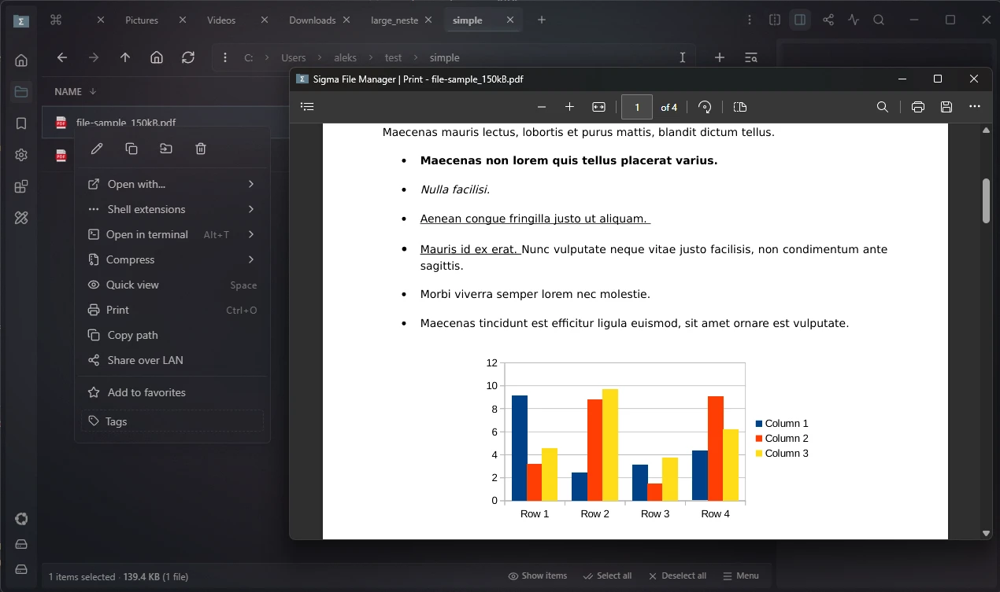

#### File Drop To Tabs

Drag files or directories onto tabs to move or copy them into another tab's directory.

- **Drop target tabs**: tabs become drop targets while dragging files in the navigator;
- **Hover activation**: hovering over a tab while dragging can switch to that tab before dropping;
- **Split tabs**: directory tab groups keep their normal drop behavior while preserving split-view tab structure;

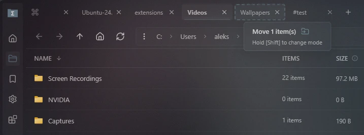

#### File Preview In Info Panel

The info panel can now preview all Quick View-supported file types, not just images and videos.

- **Media previews**: images use generated thumbnails, videos and audio include native controls, and PDFs render inline;
- **Text previews**: text files show a compact decoded preview with a safe size limit;
- **Fallbacks**: unsupported files and folders keep simple icon placeholders;

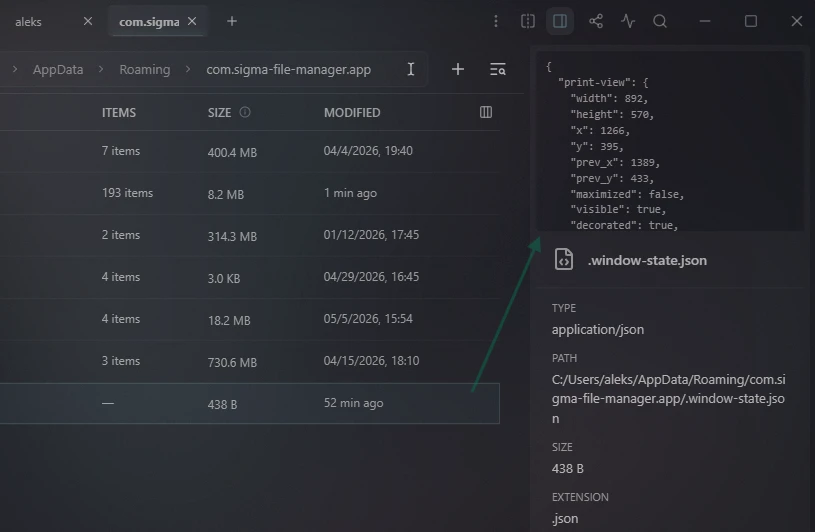

#### Navigator List Columns

List view has more optional columns and better inline metadata control.

- **Created column**: show and sort by creation date;
- **Tags column**: show tags directly in list view and add, remove, or edit tags from the column;

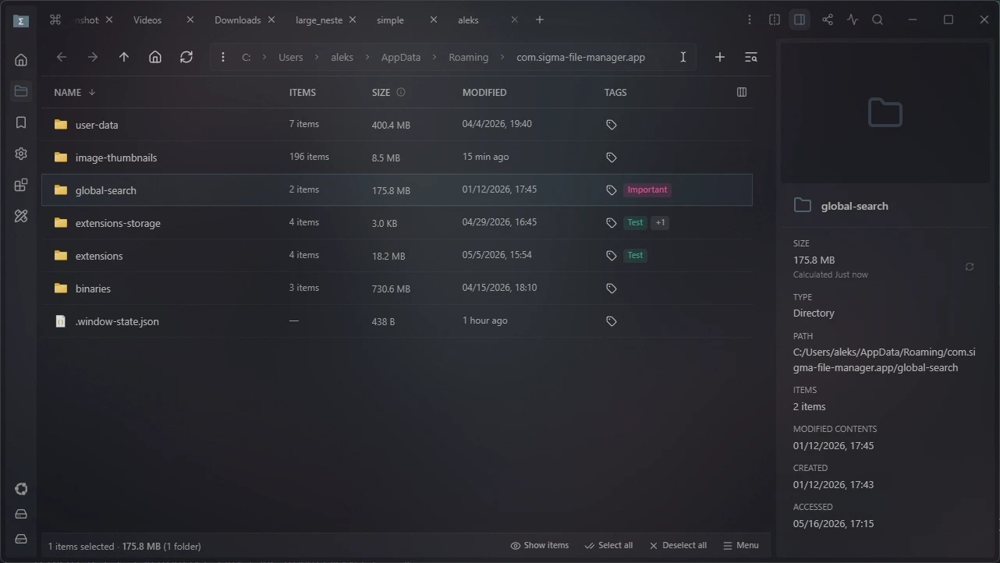

### Extensions

#### App Themes From Extensions

Extensions can now contribute full app color themes. Installed theme extensions appear in the theme selector.

#### Icon Themes From Extensions

Extensions can now contribute navigator icon themes for folders and files.

- **Separate choices**: choose folder and file icon themes independently in `Settings > UI appearance > Icon Theme`;
- **Built-in and extension themes**: use the built-in default/system icon themes or any enabled extension-provided theme;
- **Theme matching**: contributed themes can define icons by file extension, file name, folder name, and expanded folder state;

### New Settings

- **Bold active tab text**: make the active tab title bold (`Settings > Tabs > Tab appearance > Bold active tab text`);

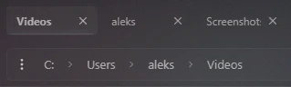

### New Shortcuts

- **Toggle split view** (`Ctrl+S`): show or hide split view in the navigator;
- **Restore closed tab** (`Ctrl+Shift+T`): restore the most recently closed tab group;
- **Create file / directory** (`Ctrl+Shift+M` / `Ctrl+Shift+N`): create a new file or directory in the current directory;
- **Print selected file** (`Ctrl+O`): print the selected file;
- **Open copied path** (`Ctrl+Shift+V`): open a valid path from the clipboard;
- **Switch pages** (`Alt+1` - `Alt+5`): switch between Home, Navigator, Dashboard, Settings, and Extensions;
- **Navigate directory history** (`Alt+Left` / `Alt+Right`): go back or forward in navigator history;
- **Navigate to parent directory** (`Alt+Up`): go to the parent directory;
- **Mouse history buttons** (`Mouse Button 4` / `Mouse Button 5`): navigate back and forward with mouse side buttons;

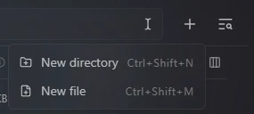

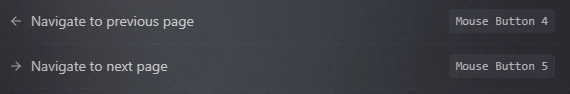

### UX Improvements

#### Large Directory Performance

Navigation, quick search, and media-heavy folders are more responsive and use less memory.

- **Generated thumbnails**: image and video thumbnails are generated at smaller sizes instead of loading full media into every file card;
- **Progressive images**: grid image cards can show a blurred low-resolution thumbnail before the final thumbnail is ready;
- **Thumbnail cancellation**: thumbnail generation can be cancelled when the folder or visible entries change;
- **Rendering performance**: large directory entries use more efficient rendering and Quick View uses generated thumbnails with a virtual list;

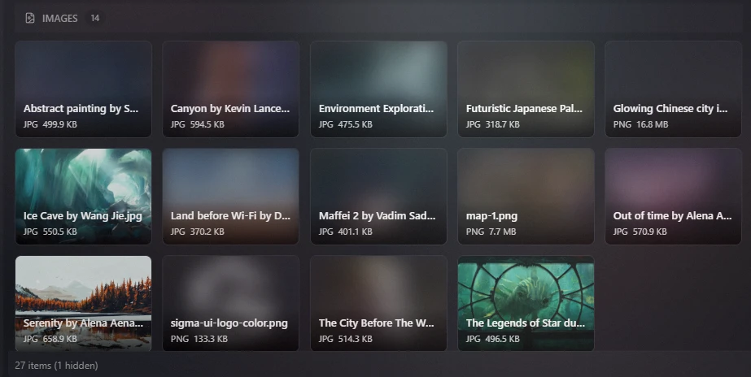

#### Quick Search

Quick search now has 2 modes: passive and active:

- **Passive mode**: acitvates automatically when you start typing. It filters entries without focusing search input and doesn't prevent navigation. 
- **Active mode**: activates with `Ctrl+F`. It focuses search input and prevents navigation but allows more fine-grained control over entered query.

Other changes:

- **Type to filter**: typing alphanumeric keys now always starts quick search (passive mode) in the active pane;
- **Keyboard navigation**: the first matching item is auto-selected;
- **Popover design**: the quick search popover is more compact and avoids covering directory items;

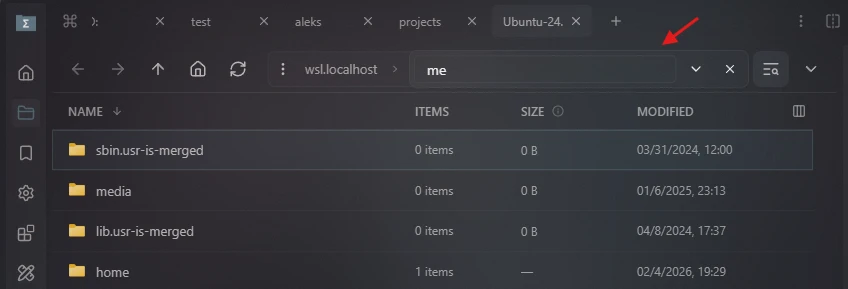

#### Address Editor

The address editor can now be used as a broader path launcher.

- **Files and directories**: open files as well as directories from the address editor;
- **Frequent paths**: switch to a mode focused on quickly opening frequently used paths;
- **Suggestions**: browse directory entries, exact matches, recent paths, tagged items, user folders, and system drives;
- **Keyboard actions**: navigate backward, forward, upward, and reveal an entry in its parent directory from the editor;

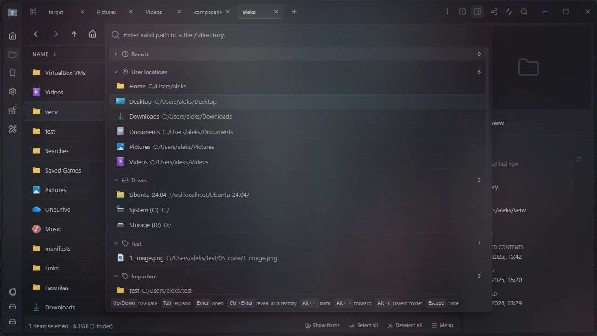

#### Status Center

The status center is now a compact toolbar widget with clearer operation groups.

- **Active count**: the toolbar button expands into a pill that shows active operation count;
- **Operation groups**: active and completed operations are separated, with completed operations in a collapsible section;
- **Cancel all**: cancel active operations in parallel from the section header;
- **Job cards**: operation cards show clearer type and status labels such as `Copy | Success` or `Archive | Error`;
- **Clipboard recovery**: paste clears the clipboard as soon as a job is queued and restores it if the job fails;

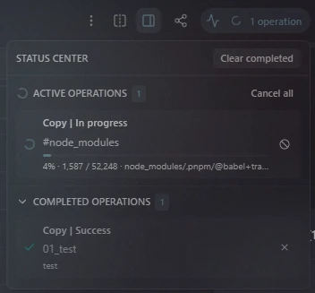

#### Navigation And Tabs

Navigator movement and tab behavior are more predictable.

- **Sidebar drives**: clicking a drive in the navigation sidebar opens it in the current tab;
- **Current directory**: the current address part is more pronounced, and its context menu opens from right click on the last address part;
- **Closed tabs**: restored tabs return to their previous position, preserve renamed paths, and redirect deleted paths to home;
- **Responsive layout**: toolbar navigation buttons collapse earlier, split-view address bars move to a second row in very narrow panes, and compact tabs keep consistent height;

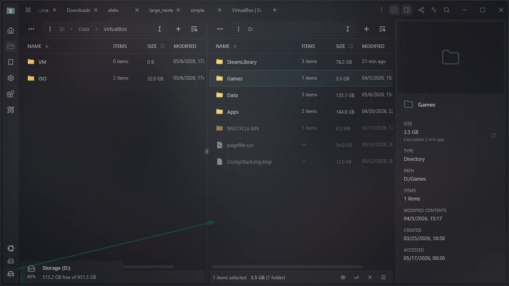

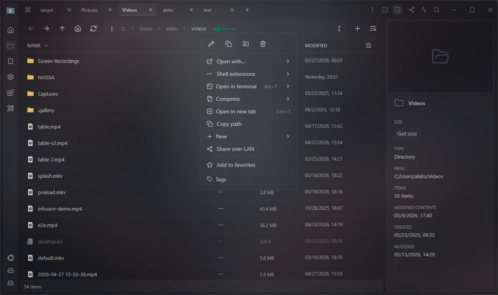

#### Shortcut Management

Shortcut editing now handles conflicts and customization more clearly.

- **Multiple bindings**: assign multiple shortcuts to one action;
- **Unassigned shortcuts**: unassign shortcuts;
- **Conflict replacement**: replace a conflicting shortcut directly from the conflict prompt;
- **Shortcut list menu**: manage shortcuts from a context menu in the shortcuts list;

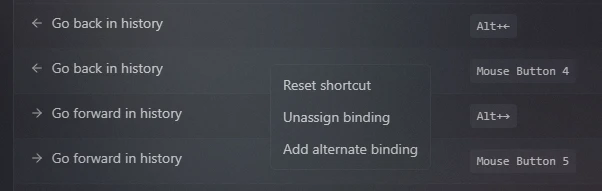

#### Drag-and-drop

Allow to start outbound drag by switching apps. Now files can be dragged out with Alt+Tab (not only by cursor leaving window);

### UI Improvements

- **Selection ring**: improved navigator selection ring opacity, offset, pane-header styling, and keyboard focus behavior;
- **Tab bar**: improved tab bar styles and active tab readability;
- **Theme selection**: improved theme selection design;
- **Quick access**: refined quick access panel styling;
- **Splash screen**: added an app splash screen during startup;
- **Popover visibility**: improved visibility for translucent popover elements;
- **Tooltips**: added tooltips to more toolbar buttons;
- **Translations**: improved Japanese and Vietnamese language strings and cleaned up locale structure;

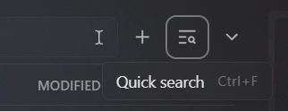

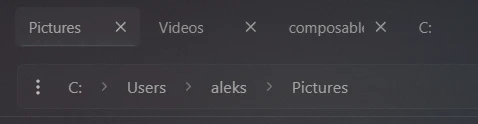

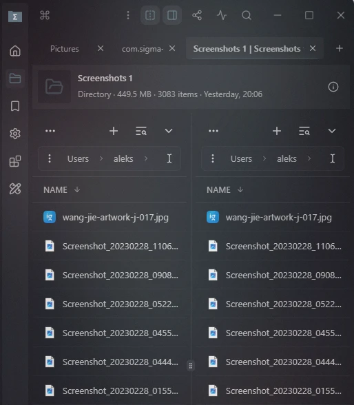

### Bug Fixes

- **Mapped drives**: fixed mapped network drive dnd out is not working;
- **Keyboard scrolling**: fixed the issue with the first row hiding behind the sticky header;
- **Startup freeze**: fixed rare multi-minute startup freezes on Windows caused by slow synchronous system calls during startup and update checks;
- **Archive extraction**: preserved Unix file modes when extracting archives;
- **Extension HTTP**: restored permanent non-2xx response handling and made retry waits cancellable;
- **Command palette**: fixed the command palette toolbar button when its shortcut is customized;
- **Grid range selection**: fixed range selection in grid view selecting entries outside its scope;
- **Context menus**: fixed selected-item and current-directory context menus staying open after action clicks;
- **Shortcut registration**: fixed shortcut registration errors after window reload;
- **Theme application**: fixed selected themes not applying in all windows;
- **macOS moves**: fixed cross-volume move handling on macOS and enabled bundle targets;
- **Default file manager**: made Windows default file manager registry restore safer when enabling fails or when restoring previous system values;

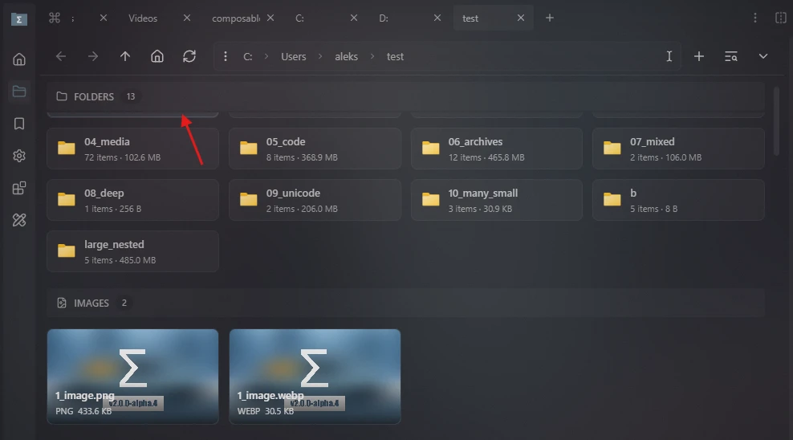

---

## [2.0.0-beta.3] - April 2026

**Summary:** Extensions system with marketplace, LAN file sharing, quick access menu, zip archives, WSL drives, tag editing, enhanced quick view and search, visual effects improvements, and many UX and stability improvements.

- [New Features](#new-features)
  - [Extensions System](#extensions-system)
  - [Default file manager](#default-file-manager)
  - [LAN Sharing](#lan-sharing)
  - [Quick Access Menu](#quick-access-menu)
  - [Zip Archives](#zip-archives)
  - [WSL Drives Detection](#wsl-drives-detection)
  - [Tag Editing](#tag-editing)
  - [In-App Updates](#in-app-updates)
  - [Copy Path](#copy-path)
  - [Close Duplicate Tabs](#close-duplicate-tabs)
  - [Home & Dashboard Context Menus](#home--dashboard-context-menus)
  - [Visual Effects Mix Blend Mode](#visual-effects-mix-blend-mode)
- [New Settings](#new-settings)
- [New Shortcuts](#new-shortcuts)
- [New Languages](#new-languages)
- [UX Improvements](#ux-improvements)
  - [Quick View Enhancements](#quick-view-enhancements)
  - [Quick Search Enhancements](#quick-search-enhancements)
  - [File Operations](#file-operations)
  - [Visual Effects](#visual-effects)
- [UI Improvements](#ui-improvements)
- [Bug Fixes](#bug-fixes)

### New Features

#### Extensions System

Full extension system with open marketplace.

- **Marketplace**: browse, install, and manage extensions from the marketplace;
- **Local installation**: you can install extensions from local folder;
- **Command palette**: new way to activate app and extension commands;
- **Capabilities**: extensions can register local and global shortcuts, context menu items, settings, whole pages, and commands;
- **Versioning**: you can install different versions of extensions and enable auto update;
- **Localization**: extensions can provide translations for different langauges;
- **Binary management**: extensions can use binaries (ffmpeg, deno, node, yt-dlp, 7z, and any other existing binary);
- **Sandboxed execution**: extensions run in isolated ESM sandboxes with granular permissions;

#### Default file manager

You can now make SFM the default file manager on Windows (`Settings > Experimental`). When this setting is enabled, most system file actions will be routed to SFM:

- File Explorer app icon;
- `Ctrl+E` shortcut;
- Reveal file in folder;
- Show downloads (when you download a file in browser);
- Terminal commands: "start {path}", "code {path}", etc.
- And more;

Native system views like "Recycle Bin", "Control panel", and such deeply integrated programs are delegated back to native File Explorer. 

#### LAN Sharing

Share and stream files and directories over your local network directly from the app.

Access LAN sharing from the toolbar button in the navigator or from the context menu on any file or directory. When a share is active, a QR code and shareable URLs are displayed. Two modes are available:

- **Stream**: stream files and directories to any device on your network via a web browser;
- **FTP**: share files over FTP for direct access from other apps. You can both download and upload files from and to the computer from other device;

#### Quick Access Menu

The "Dashboard" button in the sidebar now acts as a quick access menu. Hovering over it opens a panel showing your Favorites and Tagged items.

All items in the panel are real directory entries - you can drag and drop items in and out, open context menus with right click, and perform any standard file operations.

Can be disabled in `Settings > UI appearance > Open quick access panel on hover`.

#### Zip Archives

Compress and extract zip archives directly from the file browser actions menu:

- **Extract**: extract a `.zip` file to the current directory or to a named folder;
- **Compress**: compress selected files and directories into a `.zip` archive;

#### WSL Drives Detection

On Windows, the app now automatically detects installed WSL distributions and displays their drives in the navigator, allowing you to browse WSL file systems natively.

#### Tag Editing

You can now edit tag names and colors. Open the tag selector on any file or directory to rename tags, change their color, or delete them.

#### In-App Updates

You can now download and install updates directly from the update notification without leaving the app.

#### Copy Path

Added "Copy path" option to the file and directory context menu.

#### Close Duplicate Tabs

Added the ability to close duplicate tabs from the tab bar, removing all tabs that point to the same directory.

#### Home & Dashboard Context Menus

Items on the home page and dashboard now have full context menus, matching the functionality available in the navigator.

### New Settings

- **Show home media banner**: show or hide the home page media banner (`Settings > UI appearance > Home page media banner`);
- **Tooltip delay**: configure the delay before tooltips appear (`Settings > UI appearance > Tooltips`);
- **Relative time**: display recent timestamps in relative format, e.g. "5 min ago" (`Settings > General > Date / time`);
- **Date and time format**: configure month format, regional format, 12-hour clock, seconds, and milliseconds (`Settings > General > Date / time`);
- **Dialog backdrop blur**: set the blur intensity for dialog backdrops (`Settings > UI appearance > Style settings`);
- **Brightness and contrast filters**: adjust brightness and contrast style filters for the app UI (`Settings > UI appearance > Style settings`);
- **Overlay media brightness**: adjust brightness of the visual effects overlay media (`Settings > UI appearance > Visual effects`);
- **Visual Effects Mix Blend Mode**: adjust mix blend mode for visual effects, letting you choose how background media blends with the app UI (`Settings > UI appearance > Visual effects`);
- **Pause background video**: pause the home banner and background video when the app is idle or minimized (`Settings > UI appearance > Visual effects`);
- **Default file manager**: set Sigma File Manager as the default file explorer on Windows (`Settings > Experimental`);
- **Launch on system login**: automatically launch the app when you log into your system (`Settings > General > Startup behavior`);

### New Shortcuts

- **Copy current directory path** (`Ctrl+Shift+C`): copy the current directory path to clipboard;
- **Reload current directory** (`F5`): refresh the navigator file list;
- **Zoom in / out** (`Ctrl+=` / `Ctrl+-`): increase or decrease UI zoom;
- **Fullscreen** (`F11`): toggle full screen mode;

### New Languages

- **Hindi**;
- **Urdu**;

### UX Improvements

#### Quick View Enhancements

- **Media navigation**: navigate between files in the current directory without closing quick view;
- **Text file preview**: improved text file preview with proper encoding detection, inline editing, and parsed markdown rendering;

#### Quick Search Enhancements

- **All properties**: search by any file property - name, size, item count, modified, created, accessed, path, or MIME type (e.g. `modified: today`, `mime: image`);
- **Size ranges**: filter by size using comparisons and ranges (e.g. `size: >=2mb`, `size: 1mb..10mb`);

#### File Operations

- **Conflict resolution safety**: improved file safety within the conflict resolution modal to prevent accidental data loss;
- **Single-use paste**: copied items can only be pasted once, preventing accidental duplicate pastes;
- **Copy text**: allow copying UI text with `Ctrl+C` when no files are selected;

#### Visual Effects

- **Background manager**: added background manager to the settings page for centralized background customization;
- **Background effects reset**: added a reset button to background effects settings;

#### Other

- **App size reduction**: reduced app bundle size from 32 MB to 12 MB;
- **Global search**: display a "show settings" button in empty state and increased default search depth;
- **Windows shortcuts**: `.lnk` files now open their target in the navigator instead of launching externally;
- **Dashboard**: improved tagged section layout;
- **Address bar context menu**: added context menu to address bar items;
- **Navigator context menu**: show context menu when clicking empty area in the navigator;
- **Open in new tab**: open directories in a new tab with middle mouse click;
- **Tab scroll**: scroll newly added tabs into view automatically;
- **Menu focus**: menus no longer return focus to their trigger button when closed with a click outside;
- **Close search**: close global search with `Escape`;
- **Faster launch**: slightly improved app launch speed by preloading settings in Rust;
- **User directories**: added ability to add and remove user directories on the home page;
- **List limits**: decreased limits for frequent and history list entries to improve performance;

### UI Improvements

- **Toolbar icons**: unified toolbar icon colors across the app;
- **Card animations**: added stagger and fade-in effects to cards;
- **Light theme**: improved light theme colors and contrast;
- **Launch stability**: improved visual stability during app launch to reduce flickering;
- **Notifications**: improved notification design for better consistency;
- **Tab auto-scroll**: auto scroll the selected tab into view when opening the navigator page;
- **Root path labels**: normalized root path labels across tabs and info panel;
- **Translations**: improved translations across the app;

### Bug Fixes

- Fixed copying or moving many items freezing the UI; added file operation progress to the status center;
- Fixed deleting many items freezing the UI; added deletion progress to the status center;
- Fixed context menu in grid layout not opening for the current directory when another item already has a menu open;
- Fixed info panel not displaying all information for the current directory;
- Fixed app shortcuts being registered on the quick view window instead of only the main window;
- Fixed files dragged from web browsers not being handled;
- Fixed filenames from external URL drops not keeping valid segments;
- Fixed home banner being draggable;
- Fixed system icon cache not being keyed by file path, causing incorrect icons;
- Fixed inaccessible Windows root entries showing in the navigator;
- Fixed custom shortcuts being unidentified on some keyboard layouts;
- Fixed SSHFS connections on Linux;
- Fixed address bar creating duplicate history entries on breadcrumb click;
- Fixed global search results not responding to keyboard navigation;
- Fixed global search results not opening on click;
- Fixed global search status not syncing after incremental indexing;
- Fixed outbound file drag-and-drop not working in some applications;
- Fixed inconsistent shortcut badge design across the app;
- Fixed navigator column visibility in narrow panes;

---

## [2.0.0-beta.2] - February 2026

**Summary:** Global shortcuts, new settings, new features, improved file filtering, improved address bar, home banner improvements, and bug fixes.

### Global Shortcuts

You can now use keyboard shortcuts to interact with the app even when it's not in focus.

Added shortcuts:

- `Win+Shift+E` to show and focus the app window;

### New settings

Added setting to choose what happens when the last tab is closed.

### New features

Added new early preview features:

- Network locations: allows you to connect a network location (SSHFS (SSH) / NFS / SMB / CIFS);
- [Linux] Drive mounting: allows you to unmount locations;

### File Filter

The file filter was improved:
- Now when you change directory, it clears and closes automatically;
- The "filter on type" feature activates in the selected pane, not the first one; 

### Address Bar

- Improved design and autocomplete logic;
- The path dividers are now dropdown menus that provide quick navigation to any parent directory;

### Home Banner / Background effects

- Improved media banner editor design: 
  - Media banner options menu now opens to the bottom to avoid obscuring the view; 
  - You can now click outside to close the background position editor;
  - URL input moved above custom backgrounds; 
- Custom images/videos can be used in background visual effects;
- Removed some default media banner images;
- Added new banner image "Exile by Aleksey Hoffman";

### UX Improvements

- App restores previous window position on launch;
- The current tab can now be closed with shortcut `Ctrl+W` or middle mouse click;
- Increased file icon size in grid layout view;

### Bug Fixes

- Fixed moving files between tabs sometimes moving them to the wrong location;
- Fixed navigator sometimes showing wrong system icons for directories;
- Fixed multiple app and tray instances being created;
- Fixed shell extensions menu refetching data periodically which was forcing the list to scroll top all the time;

## [2.0.0-beta.1] - February 2026

**Summary:** Major usability and design improvements including keyboard navigation, new shortcuts, open in terminal, directory auto-refresh, drag and drop, and enhanced search and list views.

### Keyboard Navigation

Navigate files using the keyboard with full support for grid and list layouts and split view.

- Arrow keys for spatial navigation in grid view and sequential navigation in list view;
- Enter to open selected directory or file, Backspace to navigate back;
- Ctrl+Left / Ctrl+Right to switch focus between split view panes;
- Ctrl+T to open the current directory in a new tab;
- All navigation shortcuts are customizable in Settings > Shortcuts;

### Directory Auto-Refresh

The navigator view automatically refreshes when files are created, deleted, renamed, or modified in the current directory.

- File sizes update automatically when changed by external applications;
- Efficient file system watching with debouncing to avoid excessive refreshes;
- Smart diff-based updates only change affected items, preserving scroll position and selection;

### Drag and Drop

<video width="100%" mute autoplay loop controls src="./public/changelog/assets/beta-1/drag-and-drop.mp4"></video>

You can now drag files and folders around to copy/move them with ease. Drag between panes, from or to search results lists, from or to external apps.

### Copy conflicts

Added modal window for easy copy/move conflict resolution.

### Auto Update

Added automatic checking for updates (can be controlled from settings).

### Home Banner Media Editor

Added editor for home page banner customization. You can now upload custom images and videos (both local and remote URL files are supported) 

### List View Enhancements

- Improved design and fixed little annoyances;
- Added column visibility customization: choose which columns to display;
- Added column sorting: click column headers to sort entries;
- Default navigator layout changed to list view;

### Global Search Improvements

- Updated layout and design with drag and drop support;
- Search is now available while drives are still being indexed;

### Open in Terminal

Open directories in your preferred terminal directly from the context menu.

- Automatic detection of installed terminals on Windows, macOS, and Linux;
- Windows Terminal shows all configured shell profiles with executable icons;
- Linux default terminal auto-detected and shown first;
- Includes normal and admin/elevated modes;
- Default shortcut: Alt+T;

### Localization

- Added Slovenian language (thanks to: @anderlli0053);

### UI / UX Improvements

- Added font selector: choose UI font from installed system fonts;
- Added "Create new" menu for quickly creating files or directories;
- Showing empty state view when navigating to empty directories;
- Status bar shows total items with hidden count when list is filtered;
- Newly created, copied, and moved items auto-scroll into view;
- Clipboard toolbar displayed once below panes instead of in each pane;
- Simplified rename modal design;
- Responsive toolbar icons that collapse into dropdown on small window sizes;
- Removed empty "Navigation" tab from settings;
- Renaming a directory now updates its path across all tabs, workspaces, favorites, tags, history, and frequent items;
- Deleting a file or directory now removes it from all stored lists and navigates affected tabs to home;
- Non-existent paths in favorites, tags, history, and frequent items are now auto-cleaned on startup;

### Bug Fixes

- Fixed global search indexing status not updating in real-time;
- Fixed split view pane not updating when its directory is deleted or renamed from the other pane;
- Fixed tabs loading with an error when their stored path no longer exists;
- Fixed system icons showing the same icon for all files of the same type instead of unique per-file icons;
- Fixed keyboard shortcuts not working in the second pane of split view;
- Fixed keyboard shortcuts stopping to work after page navigation;
- Fixed memory leak with filter keydown listeners not cleaned up on unmount;
- Linux: added support for default app retrieval in "open with" menu;

---

## [2.0.0-alpha.6] - January 2026

**Summary:** What's New window, Quick View, context menu enhancements, and new settings.

### What's New window

A changelog window that shows new features and improvements for each release.

- Automatically appears after updates (can be disabled);
- Browse through all releases;
- See detailed descriptions and screenshots for each feature;

### Quick View

Preview files without fully opening them using a lightweight preview window.

- Press `Space` or "Quick view" option in the context menu to quickly view files;
- Close instantly with `Space` or `Escape`.
- Supports images, videos, audio, text files, PDFs, and more;

<video width="100%" mute autoplay loop controls src="./public/changelog/assets/alpha-6/quick-view.mp4"></video>

### Directory Size Calculation

- The size of directories is now auto calculated;
- You can see the total size of all directories, including all subdirectories and files, as soon as you open any directory;

### New Context Menu Options

#### Open With

- Choose which application to open a file with;
- Setup custom presets to open files in applications with flags;
- View all compatible applications for any file type;
- Set default applications for specific file types;

#### Shell Extensions

- Access Windows shell context menu items;
- Access third-party shell extensions (7-Zip, Git, etc.);

### New Settings

#### Drive Detection

- Focuses the app when removable drives are connected (can be disabled);
- Control Windows Explorer auto-open behavior for removable drives;

#### Filter on Typing

Start typing anywhere in the navigator to instantly filter items in the current directory;

#### Settings Search Shortcut

New keyboard shortcut for quick access to settings search;

#### User Statistics Data

- Added statistics settings section;
- On dahsboard page you can see, navigate, clear history, favorites, and frequently used items;

### Search Improvements

Improved global search with a hybrid indexed + direct search system for more reliable and up-to-date results.

- Searches now consistently take less than 1 second (~1 TB fully filled drive), no matter where the files are on your drives; 
- When you search your "priority paths" (the ones that you open often), you get results instantly and it finds the files even if they were just created and weren't indexed yet.

#### Priority paths include: 
- User directories: Downloads, Documents, Desktop, Pictures, Videos, Music;
- Favorites;
- Recently opened;
- Frequently used;
- Tagged;

---

## [2.0.0-alpha.5] - January 2026

**Summary:** File operations, global search, and shortcut customization.

### Global Search

Powerful full-disk search that indexes and searches files across all your drives. Features fuzzy matching to find files even with typos, automatic periodic re-indexing, priority indexing for frequently used directories, and optional parallel scanning for faster indexing.

### File Operations

Full file operation support with copy, move, and delete functionality including progress tracking. Also includes in-place file and folder renaming.

### Shortcut Editor

Customize all keyboard shortcuts in the app. View current bindings, detect conflicts, and reset to defaults.

### Navigator Enhancements

Added option to display native system icons for files and directories instead of minimalistic glyphs. Settings navigation tabs now stick to the page when scrolling.

---

## [2.0.0-alpha.4] - January 2026

**Summary:** Home page, visual effects, and user customization options.

### Home Page

A beautiful home page featuring an animated media banner, drive list, and quick access to common user directories like Documents, Downloads, Pictures, and more.

### Visual Effects

Customizable visual effects section in settings that adds blur, opacity, and noise effects to the app background. Supports different settings for each page.

### User Directories Editor

Customize your user directory cards with custom titles, icons, and paths. Personalize how your quick access directories appear on the home page.

### Banner Position Editor

Fine-tune the position of your home page banner backgrounds. Adjust zoom, horizontal and vertical positioning for the perfect look.

### Settings Improvements

- Settings search now works in any language, not just the current one;
- The app will restore the last visited settings tab on reload instead of opening the first one every time;

---

## [2.0.0-alpha.3] - December 2025

**Summary:** Navigator view with tabs, workspaces, and a new design system.

### Navigator View

The core file browsing experience with a modern tab system supporting workspaces, a new window toolbar design with integrated controls, and dual-pane navigation for efficient file management.

### Video Thumbnails

Added preview thumbnails for video files in the navigator.

### Design System Migration

Migrated the app from Vuetify to Sigma-UI for a more spacious, modern design with improved code quality.

---

## [2.0.0-alpha.1] - January 2024

**Summary:** Complete rewrite using modern technologies.

### Tauri Migration

Sigma File Manager v2 has been rebuilt from the ground up using Vue 3 Composition API, TypeScript, and Tauri v2. App installation size reduced from 153 MB to just 4 MB on Windows. Installed app size reduced from 419 MB to 12 MB.

### Resizable Panes

Added resizable panes feature which lets you split the navigator view in half and work with 2 directories side by side.

### Initial Features

Basic file navigation with directory listing, window management with minimize, maximize, and close controls, and an initial settings page structure.
