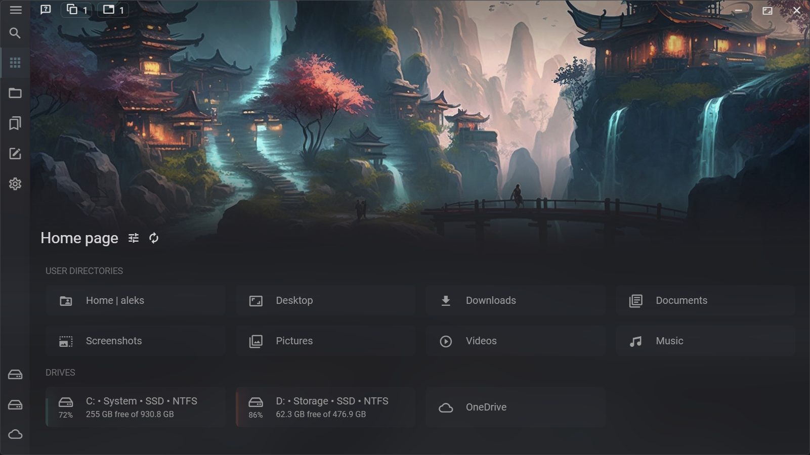

<h1>
  
  &nbsp;&nbsp;Sigma File Manager
 </h1>

"Sigma File Manager" is a free, open-source, quickly evolving, modern file manager (explorer / finder) app for Windows, MacOS, and Linux.

Designed, developed, and maintained by [Aleksey Hoffman](https://github.com/aleksey-hoffman)



<i>Artwork in the image: [Futuristic Japanese Palanquin by Julien Gauthier](https://www.artstation.com/artwork/EV8Lo4)</i>

### How to download?

See the "Download" section below.

# Features

The list of major features:

#### FEATURE #1 | SMART GLOBAL SEARCH

The search system in this app allows you to quickly find any file / directory on your computer in just a few seconds. For example, to find a file called `"2019 - Document Name.txt"`, you can type something like `"documen 2019"` (with typos, wrong case, wrong word order, missing words, missing symbols, and missing file extension) and the app will quickly find it for you (searches take about 1 second per 50 GB of data on medium tier computers).

#### FEATURE #2 | TABS

Tabs allow you to quickly switch between multiple directories with a click or a shortcut: `Alt + [0-9]`.

#### FEATURE #3 | WORKSPACES

Workspaces greatly increase your productivity by allowing you to quickly switch between separate workflows, which is especially useful when you work on multiple projects at the same time. Each workspace has its own set of tabs and its own actions. Actions can perform different operations, e.g. open a website, run a script, open a file in a specific program, etc.

#### FEATURE #4 | ADVANCED WIRELESS FILE SHARING

This feature allows you to wirelessly share a directory or stream any file to your local devices (connected to your network) in 2 clicks without installing any apps. It works on any device with a modern web browser (smart TVs, mobile devices, laptops, virtual machines, etc).

**Note:** make sure to allow the app access to the network in Firewall when prompted.

#### FEATURE #5 | ADDRESS BAR

Address bar lets you quickly navigate directories with your keyboard. It autocompletes file names and automatically opens directories as you type.

#### FEATURE #6 | ITEM FILTER

Item filter allows you to quickly filter out items (notes / files / directories) from the list so you don't have to scroll through hundreds of items trying to find the one you need. It supports advanced glob patterns and property prefixes (for specifying exact properties you want to filter).

>**Note:** It doesn't use the global search's typo correction algorithm yet. I will added in the future updates.

#### FEATURE #7 | ADVANCED FILE DOWNLOADER

This feature allows you to stream / download any file from the internet just by dragging it (or its link) onto the app.

It supports all file types, including videos and video streams (with or without auth tokens / URL timestamps).

**Warning:** do not abuse this feature. If you download a lot of content from certain services, consider supporting them in some way, at least by disabling your ad blocker on their website or even buying their premium subscriptions to support both the service and the content creators on it. Otherwise, we won't have nice things like free education, entertainment, communities, creative freedom and other great things that these platforms provide us with.

#### FEATURE #8 | SMART DRAG & DROP

The drag & drop feature is designed to simplify data transfers. It not only allows you to easily download files from the internet, it also provides a very comfortable way of transferring local files both within the app itself and other apps.

#### FEATURE #9 | SHORTCUTS

Most actions within the app can be performed with shortcuts. Even the app itself can be opened / closed with a global (system wide) customizable shortcut. This feature helps you work more efficiently and makes the process more enjoyable (e.g. you can instantly open the app and create a new note with just 1 shortcut).

#### FEATURE #10 | CUSTOMIZABLE HOME PAGE BANNER

The home page of the app has a unique, recognizable feature - a customizable media background (banner). You can set a custom image / video or choose one of the built-in artworks (kindly provided to me by the artists) and personalize the app to your liking.

#### FEATURE #11 | NOTES

Advanced note editor in this app allows you to create featureful notes and store them in one convenient, quickly accessible place.

#### FEATURE #12 | DASHBOARD

Dashboard page provides a quick access to pinned / protected / tagged items, and the timeline.

#### FEATURE #13 | FILE PROTECTION

This feature allows you to protect any file / directory / note from being modified / renamed / moved / deleted.

#### FEATURE #14 | INFO PANEL

Info panel displays useful information about the currently selected file / directory:

- Properties like "size", "path", "symlink path", "permissions", etc.;

- File preview for media files: audio, video, images (including animated gifs, apng, webp, and many other formats);

#### FEATURE #15 | ARCHIVER

Built-in archiver allows you to compress files into archives and extract existing archives. It supports all most popular formats:
  - **Packing / unpacking:** 7z, XZ, BZIP2, GZIP, TAR, ZIP, WIM.
  - **Unpacking only:** AR, ARJ, CAB, CHM, CPIO, CramFS, DMG, EXT, FAT, GPT, HFS, IHEX, ISO, LZH, LZMA, MBR, MSI, NSIS, NTFS, QCOW2, RAR, RPM, SquashFS, UDF, UEFI, VDI, VHD, VMDK, WIM, XAR, Z.

#### FEATURE #16 | QUICK VIEW

This feature allows you to quickly open selected files in a preview window, rather than an external program (which usually takes longer). Quick view window can be opened with `Space` shortcut or from the context menu. Supported file types: images, videos, audio, PDF, most plain text formats.

#### FEATURE #17 | AUTO UPDATES

The app updates itself automatically. It will let you decide if and when you want to download and install an update.

#### FEATURE #18 | CUSTOMIZABLE, WELL THOUGHT-OUT, MODERN DESIGN

This app is designed to pack lots of advanced features, without sacrificing customizable, minimalistic, modern design and usability. This idea propogates all the way to the smallest features of the app.

#### FEATURE #19 | COMMUNITY PARTICIPATION

Anyone can join this community, participate in the development of this app, and learn in the process.

#### MANY MORE FEATURES ARE COMING

Several more major features / improvements are already in development and will be added in the next updates. 

[Learn more about the features on this wiki page →](https://github.com/aleksey-hoffman/sigma-file-manager/wiki/Features)

[See features in development →](https://github.com/aleksey-hoffman/sigma-file-manager/discussions/31)

# Supporters

These wonderful people and companies are currently funding this project. Thanks to them I can keep improving this app, they are the reason good quality free software can exist.

<!-- <h4 style="margin: 32px 0px;">
  <a target="_blank" href="https://github.com/aleksey-hoffman/sigma-file-manager/blob/main/BAKERS.md">Full list of supporters →</a>
</h4> -->

### SPONSORS - LEVEL 2
Become the first supporter

### SPONSORS - LEVEL 1
Become the first supporter

### GENEROUS SUPPORTERS
<table>
  <tbody>
    <tr>
      <td align="center" valign="middle">
        <a href="https://www.photoancestry.com/" title="Houston Photo Restoration">
          
        </a>
      </td>
    </tr>
    <tr>
      <td align="center" valign="middle">
        <a href="https://www.photoancestry.com/" title="Houston Photo Restoration">⭐ Houston Photo Restoration</a>
      </td>
    </tr>
  </tbody>
</table>

### GRATEFUL SUPPORTERS

<div>
  <a href="https://github.com/andyundso" title="Andy Pfister">
    <b>~ Andy Pfister ~</b>
  </a>
</div>

<br>

## Join

#### 🎉 Supporter goal: 2 of 30 people joined

Supporters get rewards for supporting this project on Patreon:

- Your issues (feature requests) will have higher priority and a `supporter 💖` label;
- You will be able to vote and decide which features should be prioritized;
- Your name and the link to your project / website will be dispalyed on this page;
- You will get access to a private Discord;
- Also, thatnks to your support, you and everyone else will be getting new features in the app more frequently.

Check out the full list of rewards on Patreon:

<a target="_blank" href="https://patreon.com/sigma_file_manager">
  
</a>

#### Additional info

- Supporters are added to the list from top to bottom. The earlier you start supporting the project, the higher your name will be on the list.
- "3+ months" supporters will have the ⭐ badge displayed next to their name.
- The funding will be used for:
  - Fund the development of this project;
  - Fund the development of my other big research project: advanced tools / algorithms that will help scientists speed up development of new medications and treatments for diseases, reducing the time need to find a new medication from 10 years (current average) to just a few months, and hopefully help humanity get rid of diseases;
  - Support other open-source and open-content creators (developers, educators, digital artists, etc);

# Contributors - open-content creators

#### Artworks used in the app

Click on an image to visit the artist's page.
If you like their art, consider supporting their work. You can find their support links in the app on the artwork cards in the background manager (app home page > banner menu > background manager).

<table>
  <tbody>
    <tr>
      <td align="center" valign="middle">
        <a href="https://www.artstation.com/artwork/EV8Lo4">
          
        </a>
      </td>
      <td align="center" valign="middle">
        <a href="https://www.artstation.com/artwork/0Xl0OV">
          
        </a>
      </td>
      <td align="center" valign="middle">
        <a href="https://www.pexels.com/photo/gray-and-white-wallpaper-1103970/">
          
        </a>
      </td>
      <td align="center" valign="middle">
        <a href="https://www.pexels.com/photo/blue-and-red-galaxy-artwork-1629236/">
          
        </a>
      </td>
      <td align="center" valign="middle">
        <a href="https://www.artstation.com/artwork/g2L9Ke">
          
        </a>
      </td>
      <td align="center" valign="middle">
        <a href="https://unsplash.com/photos/sO-JmQj95ec">
          
        </a>
      </td>
    </tr>
    <tr>
      <td align="center" valign="middle">
        <a href="https://www.artstation.com/artwork/EV8Lo4">Julien Gauthier</a>
      </td>
      <td align="center" valign="middle">
        <a href="https://www.artstation.com/artwork/0Xl0OV">Ahmed Teilab</a>
      </td>
      <td align="center" valign="middle">
        <a href="https://www.pexels.com/photo/gray-and-white-wallpaper-1103970/">Johannes Plenio</a>
      </td>
      <td align="center" valign="middle">
        <a href="https://www.pexels.com/photo/blue-and-red-galaxy-artwork-1629236/">Suzy Hazelwood</a>
      </td>
      <td align="center" valign="middle">
        <a href="https://www.artstation.com/artwork/g2L9Ke">Dana Franklin</a>
      </td>
      <td align="center" valign="middle">
        <a href="https://unsplash.com/photos/sO-JmQj95ec">Kevin Lanceplaine</a>
      </td>
    </tr>
    <tr>
      <td align="center" valign="middle">
        <a href="https://www.pexels.com/video/drone-footage-of-the-waterfalls-and-the-mountain-3785075/">
          
        </a>
      </td>
      <td align="center" valign="middle">
        <a href="https://www.pexels.com/video/drone-footage-of-the-waterfalls-and-the-mountain-3785075/">
          
        </a>
      </td>
      <td align="center" valign="middle">
        <a href="https://www.pexels.com/video/drone-footage-of-the-waterfalls-and-the-mountain-3785075/">
          
        </a>
      </td>
      <td align="center" valign="middle">
        <a href="https://www.artstation.com/artwork/zOxE84">
          
        </a>
      </td>
      <td align="center" valign="middle">
        <a href="https://www.artstation.com/artwork/wgGRX">
          
        </a>
      </td>
      <td align="center" valign="middle">
        <a href="https://pixabay.com/videos/starry-sky-seis-am-schlern-14955">
          
        </a>
      </td>
    </tr>
    <tr>
      <td align="center" valign="middle">
        <a href="https://www.artstation.com/artwork/KrrA9">Klaus Pillon</a>
      </td>
      <td align="center" valign="middle">
        <a href="https://www.artstation.com/artwork/glyNx">Klaus Pillon</a>
      </td>
      <td align="center" valign="middle">
        <a href="https://www.pexels.com/video/drone-footage-of-the-waterfalls-and-the-mountain-3785075/">Taryn Elliott</a>
      </td>
      <td align="center" valign="middle">
        <a href="https://www.artstation.com/artwork/zOxE84">Marcel van Vuuren</a>
      </td>
      <td align="center" valign="middle">
        <a href="https://www.artstation.com/artwork/wgGRX">Vadim Sadovski</a>
      </td>
      <td align="center" valign="middle">
        <a href="https://pixabay.com/videos/starry-sky-seis-am-schlern-14955">Andreas</a>
      </td>
    </tr>
    <tr>
      <td align="center" valign="middle">
        <a href="https://www.artstation.com/artwork/XkP2l">
          
        </a>
      </td>
      <td align="center" valign="middle">
        <a href="https://www.artstation.com/artwork/mD3XvZ">
          
        </a>
      </td>
      <td align="center" valign="middle">
        <a href="https://www.artstation.com/artwork/reodm">
          
        </a>
      </td>
      <td align="center" valign="middle">
        <a href="https://www.artstation.com/artwork/lVJXXe">
          
        </a>
      </td>
      <td align="center" valign="middle">
        <a href="https://www.artstation.com/artwork/vY18O">
          
        </a>
      </td>
    </tr>
    <tr>
      <td align="center" valign="middle">
        <a href="https://www.artstation.com/artwork/XkP2l">Darius Kalinauskas</a>
      </td>
      <td align="center" valign="middle">
        <a href="https://www.artstation.com/artwork/mD3XvZ">Alena Aenami</a>
      </td>
      <td align="center" valign="middle">
        <a href="https://www.artstation.com/artwork/reodm">Alena Aenami</a>
      </td>
      <td align="center" valign="middle">
        <a href="https://www.artstation.com/artwork/lVJXXe">Alena Aenami</a>
      </td>
      <td align="center" valign="middle">
        <a href="https://www.artstation.com/artwork/EV8Lo4">Wang Jie</a>
      </td>
    </tr>
  </tbody>
</table>

# Download

#### ⚡ Requirements:

- **Memory (RAM):** minimum: ~100 MB, average: ~300 MB;
- **Storage:** minimum: ~200 MB;
- **OS:** 64-bit: Windows, MacOS, Linux;


<table>
  <thead>
    <tr>
      <th>Operating system</th>
      <th>Download link (latest version)</th>
    </tr>
  </thead>
  <tbody>
    <tr>
      <td>Windows</td>
      <td>
        <a target="_blank" href="https://github.com/aleksey-hoffman/sigma-file-manager/releases/">
          Sigma-File-Manager-Windows.exe
        </a>
      </td>
    </tr>
    <tr>
      <td>MacOS portable</td>
      <td>
        <a target="_blank" href="https://github.com/aleksey-hoffman/sigma-file-manager/releases/">
          Sigma-File-Manager-MacOS.pkg
        </a>
      </td>
    </tr>
    <tr>
      <td>Linux (any) portable</td>
      <td>
        <a target="_blank" href="https://github.com/aleksey-hoffman/sigma-file-manager/releases/">
          Sigma-File-Manager-Linux.AppImage
        </a>
      </td>
    </tr>
    <!-- <tr>
      <td>Linux (Ubuntu)</td>
      <td>
        <a target="_blank" href="https://github.com/d2phap/ImageGlass/releases/latest/download/Sigma_file_manager_v1.0.0_Linux.AppImage">
          Get from Software store (snap store)
        </a>
      </td>
    </tr> -->
    <tr>
      <td>Other releases</td>
      <td>
        <a target="_blank" href="https://github.com/aleksey-hoffman/sigma-file-manager/releases">
          See all releases
        </a>
      </td>
    </tr>
    <tr>
      <td>Utility for integrating AppImages into the system (launcher, dock)</td>
      <td>
        <a target="_blank" href="https://github.com/TheAssassin/AppImageLauncher">
          AppImageLauncher (for Linux only)
        </a>
      </td>
    </tr>
  </tbody>
</table>

[]()

If you like the app, consider supporting my work by joining our community on Patreon.
I have a lot of awesome things in development for you guys, but the luck of funding makes it really difficult to create anything

<a target="_blank" href="https://patreon.com/sigma_file_manager">
  
</a>


#### ⚠ Warnings:

The app is still in early development (prototyping) stage.

- The app hasn't been thoroughly tested yet. It's recommended to backup (copy) all of your important data to an external backup drive or to cloud storage before installing and using this app.
- Expect to see some errors and performance issues in the first versions of the app. I will be fixing the problems gradually as they get reported by the users.
- The app has not been optimized yet, RAM usage can spike and go over 1 GB during some operations. So, for now, avoid using the app on low-tier computers (i.e. computers with 4 GB of RAM or less).

#### 💬 Get notified

You can follow me on <a href="https://twitter.com/hoffman_aleksey" target="_blank">Twitter</a> if you want to get updates on this app, hear about my upcoming projects, participate in my future giveaways, or just hear my thoughts on different things.

If you just want to get updates on this project, you can click the "watch" button on top of the page.

#### 💡 Hidden treasures

There's a fun secret hidden somewhere in the app. See if you can find it. Hint: only the dinosaur knows about it.

# Project links

If you want to see the list of features currently in development, or ask a question, or propose a new feature, or report a problem, here are the links:

- <a target="_blank" href="https://github.com/aleksey-hoffman/sigma-file-manager/issues/new?template=Feature_request.md">Create new feature request</a>
- <a target="_blank" href="https://github.com/aleksey-hoffman/sigma-file-manager/issues/new?template=Problem_report.md">Create new problem report</a>
- <a target="_blank" href="https://github.com/aleksey-hoffman/sigma-file-manager/discussions">Create new discussion</a>
- <a target="_blank" href="https://github.com/aleksey-hoffman/sigma-file-manager/blob/main/CHANGELOG.md">See changelog (update history)</a>
- <a target="_blank" href="https://github.com/aleksey-hoffman/sigma-file-manager/discussions/31">See improvements in development</a>

# Milestones

✅ **v1.0.0 (May 25 2021):** publish the app;

✅ **by v1.1.0 (May 27 2021):** new features, improvements, and fixes;

✅ **by v1.2.0 (June 2021):** new features, improvements, and fixes;

⬜ **by v1.3.0 (Augest 2021):** new feature, improvements, and fixes. Localize the app to 10+ most popular languages;

⬜ ...

⬜ **by v2.0.0 (Oct 2021):** (1/20) Add 20 more new major features;

⬜ **End goal:** improve the app to the point of becoming the best file manager and one the most useful productivity apps. This milestone will be considered to be achieved when at least 3 reputable independent sources (reviewers / platforms) decide that the app has achieved all of the following titles:
  - ⬜ (0/3 sources) the best productivity impact;
  - ⬜ (0/3 sources) the best UI design;
  - ⬜ (0/3 sources) the best feature set;
  - ⬜ (0/3 sources) the fastest improvement rate;
  - ⬜ (0/3 sources) the most loved file manager app;
  - ⬜ (0/3 sources) the most intelligent file manager app;
  - ⬜ (0/3 sources) is one of top 3 desktop productivity apps;

**Links to reviews:** none yet.

# The app background story

Even though I've spent 3000+ hours developing this app, I decided to make it free and open-source because open-source is more than just a way to share your work, it has larger impact on the development of our society than you think.

When we create close-sourced, overly-copyrighted products, and hide our work behind paywalls and patents, with the primary goal of enriching yourself, we slow down our development.

As history has shown us, when we share our knowledge with each other freely and build upon each other's work, we increase the rate of our technological development, which improves well-being of everyone as a result. Science is the greatest example of what shared collaborative work can do for us. This is why open-source and open-content concepts are so important. Projects like this wouldn't be possible without it.

Relying on donations is no doubt a less profitable model, but I think it's better when the people who use your work are the ones who determine how much support you receive. This is how we incentivize and motivate creators to improve, to make better, more useful, more enriching products / artworks / software / technologies.

By creating this app, I also wanted to show every beginner that no project is too big for your skills - all you need to do is just start making it, work hard on it every day, learn in the process, and simply don't stop until you create something really good. That's the secret to creating something great.

This app is an example of what dedication can do for you - when I started this project I could barely code, and in just 2 years of work with budget of $0, the dedication allowed me to create an app, which in version 1.0 in some aspects can already compete with apps like MacOS "Finder" and Windows "File Explorer" which has been in development for 24+ years by a trillion dollars worth company's team of many highly paid professional developers and designers each of whom has specialized skills, experience, all the resources, tools, and computing power in the world, including super computers, AI algorithms, neural networks, the ability to employ any specialist in the world, and the enormous amounts of data. And despite not having any of this, you can still make a competitive product, if you just start making it and keep working on it. But as I said earlier, this is only possible in the world where we build upon each other's work, rather than hiding our work and experience from each other behind patents and copyrights.

This is how and why "Sigma file manager" was created. It all started from a simple idea of making a concept design, but thanks to other open-source developers, who also decided to share their work with the world, I was able to turn this idea into a quickly evolving app with great potential. Building something for others also gave me a lot of ideas for more impactful projects, some of which are already in development.

# Special thanks

**Open-source projects:**

- **Electron:** Makes it possible to create cross-platform apps for desktop platforms.
- **Vue.js:** A wonderful JS framework that speeds up web development.
- **VSCode:** One of the best code editors that significantly simplifies the development process.
- **Vuetify:** Material components library that speeds up UI development.
- **Templarian/MaterialDesign:** Provides beautiful, community created, free icons.
- **ytdl-org/youtube-dl:** Allows the app to download videos from a URL link using Python.
- **FFMPEG:** Allows the app to convert and edit audio/video/images and get the media info.
- **7-zip.org:** Allows the app to work with archives (compress/decompress directories and files).

# For developers

Developers, feel free to optimize and improve the app. Make sure to create a new issue or a discussion before implementing changes, so we can discuss the changes first.

See [CONTRIBUTING.md](./CONTRIBUTING.md) file for help, if you are new to contributing code.

You will need Node.js <= `v15.14.0` installed.

To open the project on the dev server, run the following commands:

```
cd ./sigma-file-manager && npm install && npm run electron:serve
```

To build the project for your current platform, run the following commands:

```
npm run electron:build
```

The build can be configured in the `./vue.config.js` file

# License

Sigma file manager is licensed under [GNU GPLv3 or later](./LICENSE.md).

Copyright © 2021 - present Aleksey Hoffman. All rights reserved.
  
