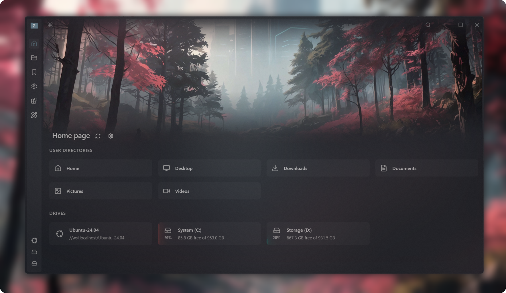

##  ⚡Latest news

- v2 moved from beta to stable stage
- v2 became the main branch

<h1>
  
  &nbsp;&nbsp;Sigma File Manager
</h1>

"Sigma File Manager" is a free, open-source, quickly evolving, modern file manager (explorer / finder) app for Windows and Linux.

Designed, developed, and maintained by [Aleksey Hoffman](https://github.com/aleksey-hoffman)

## Community links
[Discord](https://discord.gg/sxZTztFVwX) | [Reddit](https://www.reddit.com/r/SigmaFileManager) | [YouTube](https://www.youtube.com/@sigma-dev) | [X (Twitter)](https://twitter.com/sigma__dev) | [Telegram](https://t.me/sigma_devs)
 Thanks to everyone who has been sharing this project with others!

## Features

#### Major features:

- **Smart global search:** Finds files and folders in seconds (searches full `1TB` drive in ~2 seconds). Its typo correction system handles typos, wrong case, wrong word order, missing words, missing symbols, and missing file extension.
- **Tabs:** Keep multiple directories open and switch between them instantly.
- **Split view:** Any tab can be splitted into 2 panes which you can navigate indipendently and transfer files between them easily.
- **Extensions and marketplace:** Install extensions from the built-in marketplace or local folders. Extensions can add commands, pages, shortcuts, settings, and more.
- **Default file manager:** On Windows, Sigma can replace File Explorer for most everyday file actions.
- **LAN file sharing:** Share or stream files and folders over your local network, with browser access, QR codes, and FTP support.
- **Network locations (Alpha stage):** Connect to remote locations such as SSHFS, NFS, SMB, and CIFS.
- **Address bar:** Navigate with the keyboard, autocomplete paths, and quickly jump to parent folders.
- **Item filter:** Narrow large folders with glob patterns and property filters for size, dates, MIME type, and more.
- **Smart drag and drop:** Move or copy local files more comfortably, and handle web drops more smoothly.
- **Shortcuts and command palette:** Most actions are keyboard-friendly, with global shortcuts and a fast command palette for app and extension commands.
- **Home banner and visual effects:** Personalize the UI with custom images, videos, built-in artwork, transparency, blend modes, and other style controls.
- **Dashboard and quick access:** Reach favorites, tagged files, most visited locations, and history data from one central area.
- **Tags:** Organize your files and folders with tags.
- **Zip archives:** Compress files into `.zip` archives and extract them without leaving the app.
- **In-app updates:** Download and install updates directly from update notifications.
- **Quick view:** Instantly preview images, videos, audio, PDFs, and text files with `Space`, then move through files without opening external apps.
- **WSL drives:** On Windows, browse detected WSL distributions directly in the navigator.
- **Localization:** The app has translations for all most used languages. 
- And more. Extensions provide additional features like video downloading (1000+ sites supported, including YouTube, Twitch, etc.), media converter, image size optimizer, etc.

## Sponsors

<table>
  <tbody>
    <tr>
      <td>
          
      </td>
      <td>
        <b>Hover is a popular service where you buy domain names for your website.</b>
         Use my <a href="https://hover.com/UywpvNe0" target="_blank">Hover link</a> and we'll both get $2 off their domains.
      </td>
    </tr>
  </tbody>
</table>

## Supporters

Become the first.

Consider supporting the project on Patreon:

 
<a target="_blank" href="https://github.com/aleksey-hoffman/sigma-file-manager/wiki/Support-and-rewards">
  See other methods
</a>

The funding will be used for funding the development of this and my other big projects. I'm also working in collaboration with a few universities on a project that will help scientists speed up development of new medications and treatments for diseases, reducing the time need to find a new medication from 10 years (current average) to just a few months, and hopefully help humanity get rid of diseases (the project will be open-sourced later);

## Download & install

 
 
 

#### ⚡ Requirements:

**OS:** 64-bit: Windows, Linux, MacOS is supported but builds are not provided;

[All releases & changelog](https://github.com/aleksey-hoffman/sigma-file-manager/releases)

<table>
  <thead>
    <tr>
      <th>Platform</th>
      <th>Link</th>
    </tr>
  </thead>
  <tbody>
    <tr>
      <td>Windows | Winget</td>
      <td width="320px">
        <code>winget install sfm</code>
      </td>
    </tr>
    <tr>
      <td>Windows | Microsoft store</td>
      <td>
        <!--  -->
        
      </td>
    </tr>
    <tr>
      <td>Windows | Unsigned installable (might see antivirus errors)</td>
      <td>
        <a target="_blank" href="https://github.com/aleksey-hoffman/sigma-file-manager/releases/latest">
          Installable (.exe)
        </a>
      </td>
    </tr>
    <tr>
      <td>Linux | Portable (experimental)</td>
      <td>
        <a target="_blank" href="https://github.com/aleksey-hoffman/sigma-file-manager/releases/latest">
          Portable (.AppImage)
        </a>
      </td>
    </tr>
    <tr>
      <td>Linux | Flatpak</td>
      <td>
        <a target="_blank" href="https://github.com/aleksey-hoffman/sigma-file-manager/releases/latest">
          Installable (.flatpak)
        </a>
         
        <code>flatpak install ./Sigma-File-Manager-*-linux.flatpak</code>
      </td>
    </tr>
    <tr>
      <td>Linux | Snapcraft </td>
      <td>
        <a target="_blank" href="https://snapcraft.io/sigma-file-manager">
          snapcraft.io/sigma-file-manager
        </a>
         
        <code>sudo snap install sigma-file-manager --edge</code>
      </td>
    </tr>
    <tr>
      <td>If there's no compiled binary for your MacOS, Linux distro, you can build the app from the source code yourself
      </td>
      <td>
        <a target="_blank" href="https://github.com/aleksey-hoffman/sigma-file-manager/blob/main/CONTRIBUTING.md">
          See this guide
        </a>
      </td>
    </tr>
    <tr>
      <td>Linux utility for integrating AppImages into the system (launcher, dock)</td>
      <td>
        <a target="_blank" href="https://github.com/TheAssassin/AppImageLauncher">
          AppImageLauncher
        </a>
      </td>
    </tr>
  </tbody>
</table>

## For developers

If you'd like to contribute your skills to improve this project, follow this guide: [CONTRIBUTING.md](./CONTRIBUTING.md)
