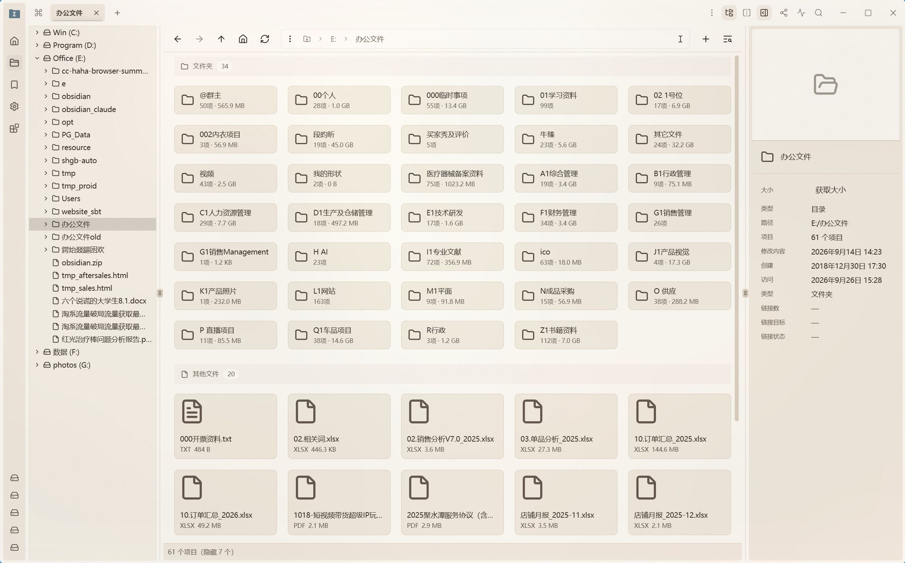

**[English](README.md)** | **[中文](README.zh-CN.md)**

<h1>
  
  &nbsp;&nbsp;Sigma File Manager (kizemo fork)
</h1>

"Sigma File Manager" is a free, open-source, quickly evolving, modern file manager (explorer / finder) app for Windows and Linux.

This repository is a personal fork maintained by [kizemo](https://github.com/kizemo) that tracks upstream [`aleksey-hoffman/sigma-file-manager`](https://github.com/aleksey-hoffman/sigma-file-manager) and adds tree-view and other ergonomic improvements on top of it.

**Pre-built fork binary**: download [**v2.2.0-tree.1 — Folder Tree Sidebar**](https://github.com/kizemo/sigma-file-manager/releases/tag/v2.2.0-tree.1) — a Windows NSIS installer built from the `feat/tree-sidebar-v6-1` branch (HEAD `8caf14ae`). This fork does **not** have a code-signing certificate, so Windows SmartScreen will warn "Unknown publisher" on first launch — click **More info** → **Run anyway**. Installer sha256: `c63ef9194c1e284e983a06d22c4e85f54eef9c5f9c18c0105570b18de58b2f35`.

## Folder tree sidebar (the main fork feature)

A left-side **folder tree sidebar** that mirrors the file system and follows the active pane, so you always see where you are and can jump up/down the hierarchy with a single click.

- **Toggle:** a dedicated `FolderTree` icon button in the navigator toolbar — it is intentionally **not** inside the layout dropdown, so the toggle stays one click away at all times.
- **Sync sources:** the tree automatically follows the address bar, the favorites / quick-access panel, and the **active pane** in split-view, so each side keeps its own tree state.
- **Single-path expand:** when you navigate, only the ancestor chain of the current path stays open; previously-open branches elsewhere are collapsed, keeping the tree compact and scannable.
- **Click semantics:** clicking a row navigates to that folder; clicking the chevron expands or collapses the branch without changing the current directory.
- **Drive labels:** root nodes show both the volume label and the drive letter, e.g. `Win (C:)`, so multi-WSD / multi-drive setups are disambiguated at a glance.
- **Persistence:** the show/hide state survives restarts via `userSettings.navigator.showFolderTree`.
- **Implementation branch:** [`feat/tree-sidebar-v6-1`](https://github.com/kizemo/sigma-file-manager/tree/feat/tree-sidebar-v6-1), HEAD `8caf14ae` — 6 atomic commits, ~3000 lines including tests and docs.
- **Tests:** 259 unit tests passing.
- **Upstream tracking:** this work is tracked against upstream issue [#499](https://github.com/aleksey-hoffman/sigma-file-manager/issues/499).

## Listary-style focus sync (Experimental)

A second experimental fork feature: any Windows app's file dialog (Chrome downloads, Word "Save As", VS Code "Open Folder", 钉钉 / 飞书 save flows, etc.) auto-jumps to Sigma's current folder when you Alt-Tab from the dialog to Sigma and back.

**Status**: Experimental — UI Automation coverage validated via the [`sigma-listary-spike/`](./../sigma-listary-spike/) subdirectory. The spike binary builds cleanly on Windows 11 with `windows` crate 0.62 and empirically validates all three capabilities (detect / read / write) on a standard Win32 OpenFileDialog. Chromium hosts are shielded by an `EnableWindow(FALSE)` RAII guard ported from QwenLM (measured 7/8 → 0 z-drops on Chromium).

**Enable**: launch `sigma-listary-spike/target/release/spike.exe` before opening Sigma. The binary communicates with Sigma over TCP on `127.0.0.1:37421` (line-based JSON protocol: `set_path`, `get_status`, `quit`).

**Limitations**:
- **No headless GUI verification on all 7 target apps** — only the Win32 #32770 dialog path is auto-verified. Manual GUI verification recommended per app before production use.
- **fg_bypass covers Chromium only** — UWP / XAML hosts are not specially shielded (port omitted QwenLM's UWP branch per spike simplification).
- **STA threading constraint** — spike uses a single-threaded tokio runtime to keep UIA on the main COM STA thread.

**Source attribution** (MIT / Apache-2.0 licenses preserved per file):
- [`inaku-Gyan/PathWrap`](https://github.com/inaku-Gyan/PathWrap) — `src/os/dialog.rs` (MIT) + `src/os/monitor.rs` (MIT)
- [`QwenLM/qwen-code`](https://github.com/QwenLM/qwen-code) — `fg_bypass.rs` (Apache-2.0)

**Spike report**: [`docs/superpowers/spike-reports/2026-09-27-listary-focus-sync-spike.md`](./../docs/superpowers/spike-reports/2026-09-27-listary-focus-sync-spike.md)
**Decision**: [`docs/superpowers/decisions/2026-09-27-listary-focus-sync-decision.md`](./../docs/superpowers/decisions/2026-09-27-listary-focus-sync-decision.md)

## Credits

- Upstream: [aleksey-hoffman/sigma-file-manager](https://github.com/aleksey-hoffman/sigma-file-manager) by [Aleksey Hoffman](https://github.com/aleksey-hoffman). All product features, branding, and release pipelines belong to upstream.
- Fork maintainer: [kizemo](https://github.com/kizemo).

## License

GPL-3.0-or-later — see [`LICENSE.md`](./LICENSE.md). Fork additions are contributed under the same license.