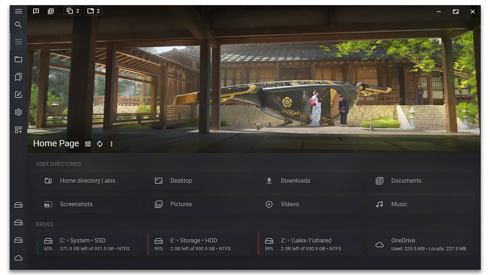

# Latest news

1. Version 1.7.0 was released. Video review: https://www.youtube.com/watch?v=ZQy754HOM7Y
2. Started creating [Sigma File Manager Next (v2.0)](https://github.com/aleksey-hoffman/sigma-file-manager/discussions/226). Rewriting the app codebase with newer, better technologies (Rust, Vue 3, Typescript), as well as improving code quality and moving away from Electron.js. Once finished, the app will become faster, more capable, and better in every other way.
3. Reddit community [r/SigmaFileManager](https://www.reddit.com/r/SigmaFileManager) was created. This is where I will post all the updates, polls, progress, image and video previews of new / modified features, tips, etc. Check it out and post some cool ideas!

# What's new in `v1.7`

- 4 new features
- 9 improvements
- 5 fixes

<a target="_blank" href="https://github.com/aleksey-hoffman/sigma-file-manager/releases">
  SEE RELEASE NOTES →
</a>

<h1>
  
  &nbsp;&nbsp;Sigma File Manager
 </h1>

"Sigma File Manager" is a free, open-source, quickly evolving, modern file manager (explorer / finder) app for Windows and Linux.

Designed, developed, and maintained by [Aleksey Hoffman](https://github.com/aleksey-hoffman) | [Twitter](https://twitter.com/sigma__dev) | [Reddit](https://www.reddit.com/r/SigmaFileManager) | [YouTube](https://www.youtube.com/@sigma-dev) 

Thanks to everyone who has been sharing this project with others!

# Goal

Create the best existing intelligent file manager & productivity app that will significantly speed up your workflow, provide you with advanced tools, and keep your data safe.

`Done 21 of 100` major features.

# Features

#### The list of major features:

- **SMART GLOBAL SEARCH:** feature allows you to find any file / directory on your computer in just a few seconds. It also implements a typo correction system, allowing you to find files even when the search query includes typos, wrong case, wrong word order, missing words, missing symbols, and missing file extension.

- **TABS:** feature allows you to quickly switch between multiple directories with a click or a shortcut.

- **WORKSPACES:** feature allows you to create separate workspaces with their own tabs and pre-defined actions, allowing you to quickly switch between them. Actions can perform different operations, e.g. open a website, run a script, open a file in a specific program, etc.

- **ADVANCED WIRELESS FILE SHARING:** share a directory or stream any file to your local devices wirelessly without installing any apps. It works on any device with a modern web browser (smart TVs, mobile devices, laptops, virtual machines, etc).

- **ADDRESS BAR:** lets you quickly navigate directories with your keyboard. It autocompletes file names and automatically opens directories as you type.

- **ITEM FILTER:** allows you to filter out items from the list to quickly find the one you need. It supports advanced glob patterns and property prefixes.

- **ADVANCED FILE DOWNLOADER:** stream / download any file from the internet just by dragging it (or its URL link) onto the app. It supports all file types, including videos from video services like Youtube and video streams (with or without auth tokens / URL timestamps).

- **SMART DRAG & DROP:** allows you to easily download files from the internet, and provides a comfortable way of copying / moving local files.

- **SHORTCUTS:** most actions within the app can be performed with shortcuts. You can also create global (system wide) shortcuts for some actions like opening / hiding the app or opening the app and instantly creating a new note.

- **CUSTOMIZABLE HOME PAGE BANNER:** The home page of the app has a unique, recognizable feature - a customizable media background (banner). You can set a custom image / video or choose one of the built-in artworks (kindly provided to me by different artists) and personalize the app to your liking.

- **NOTES:** Advanced note editor in this app allows you to create featureful notes and store them in one convenient, quickly accessible place.

- **DASHBOARD:** Dashboard page provides quick access to pinned / protected / tagged items, and the timeline.

- **FILE PROTECTION:** This feature allows you to protect any file / directory / note from being modified / renamed / moved / deleted.

- **INFO PANEL:** displays useful information about currently selected file / directory and the file preview for media files: audio, video, images (including animated gifs, apng, webp, and many other formats).

- **ARCHIVER:** built-in archiver allows you to compress files into archives and extract existing archives. It supports all most popular formats. See the list of formats on the <a href="https://github.com/aleksey-hoffman/sigma-file-manager/wiki/Features">"features" wiki page</a>

- **AUTO UPDATES:** the app updates itself automatically. It will let you decide if and when you want to download and install an update.

- **COMMUNITY PARTICIPATION:** unlike closed-sourced apps, you participate in the development of this app (request features, vote which features should be prioritized, participate in discussions, modify code of the app yourself).

- **QUICK VIEW:** allows you to quickly open selected files in a preview window, rather than an external program by pressing `Space` button. It supports images, videos, audio, PDF, most plain text formats.

- **INFUSIVE DESIGN:** this app implements my custom, modern, beautiful, minimalistic, customizable, design system called "Infusive design".

- **WINDOW TRANSPARENCY EFFECTS:** feature allows you to customize the app design and create literally infinite amount of custom, beautiful, modern UI designs by allowing you to beautifully infuse any image / video into every element of the app UI.

- **LOCALIZATION:** the app interface can be displayed in any language. The languages can be edited, and new languages can be added by the community.

#### MANY MORE FEATURES ARE COMING

Several more major features / improvements are already in development and will be added in the next updates. 

#### MORE INFO
<a href="https://github.com/aleksey-hoffman/sigma-file-manager/wiki/Features">DETAILED FEATURE DESCRIPTION (WIKI) →</a>

<a href="https://github.com/aleksey-hoffman/sigma-file-manager/discussions/31">FEATURES IN DEVELOPMENT →</a>

# Supporters

Consider supporting the developer on Patreon (monthly, with [rewards](https://patreon.com/sigma_file_manager)) or via crypto:

<table>
  <thead>
    <tr>
      <th>Platform</th>
      <th>Address</th>
    </tr>
  </thead>
  <tbody>
    <tr>
      <td>Patreon</td>
      <td width="320px">
        
      </td>
    </tr>
    <tr>
      <td>BTC</td>
      <td width="320px">
        <code>bc1qv5ujcuwjsk505qjhd3sptcf3xpvjktqjxj0wrc</code>
      </td>
    </tr>
    <tr>
      <td>USDT (Tron TRC-20)</td>
      <td width="320px">
        <code>TN3hFLmjY2eXR149yKMq1qZQotmZbTGV4a</code>
      </td>
    </tr>
  </tbody>
</table>

## Sponsor

[Become the first sponsor](https://github.com/aleksey-hoffman/sigma-file-manager/wiki/Supporter-rewards)

## Level-4 supporter

<table>
  <tbody>
    <tr>
       <td align="center" valign="middle">
        
      </td>
      <td>
       <a href="https://www.photoancestry.com/" title="Houston Photo Restoration">photoancestry.com</a>
       
Houston's #1 Photo Restoration Service

      </td>
    </tr>
  </tbody>
</table>

## Level-3 supporter

<table>
  <tbody>
    <tr>
      <td align="center" valign="middle">
        <a href="https://github.com/andyundso" title="Andy Pfister">
          
          Andy Pfister
        </a>
      </td>
      <td align="center" valign="middle">
        <a href="https://github.com/exploitacious" title="Alex Ivantsov">
          
          Alex Ivantsov
        </a>
      </td>
    </tr>
  </tbody>
</table>

## Level-2 supporter

  <a href="https://github.com/theoob" title="Tony Kelly">
    <b>Tony Kelly</b>
  </a>
  ~ <a href="https://github.com/julienripet" title="Julien Ripet">
    <b>Julien Ripet</b>
  </a>
  ~ <a href="https://github.com/valentimarco" title="Marco Valenti">
    <b>Marco Valenti</b>
  </a>
  ~ <a href="https://github.com/HarkTu" title="Shtiliyan Karamfilov">
    <b>Shtiliyan Karamfilov</b>
  </a>

 

<h4 style="margin: 32px 0px;">
  <a target="_blank" href="https://github.com/aleksey-hoffman/sigma-file-manager/blob/main/BAKERS.md">See the full list of supporters →</a>
</h4>

The funding will be used for funding the development of this and my other big projects. Right now, I'm also working in collaboration with a few universities on advanced tools / algorithms that will help scientists speed up development of new medications and treatments for diseases, reducing the time need to find a new medication from 10 years (current average) to just a few months, and hopefully help humanity get rid of diseases (the project will be open-sourced in a few months);

# Download

#### ⚡ Requirements:

- **Memory (RAM):** minimum: ~100 MB, average: ~400 MB;
- **Storage:** minimum: ~370 MB;
- **OS:** 64-bit: Windows, Linux;

#### 📎 Download links:

You can install the app in one of these ways:

<table>
  <thead>
    <tr>
      <th>Operating system</th>
      <th>Download link (latest version)</th>
    </tr>
  </thead>
  <tbody>
    <tr>
      <td>Windows (via winget)</td>
      <td width="320px">
        <code>winget install --id=AlekseyHoffman.Sigma-File-Manager --source winget</code>
      </td>
    </tr>
    <tr>
      <td>Windows (via Microsoft store)</td>
      <td>
        
      </td>
    </tr>
    <tr>
      <td>Windows (unsigned installable)</td>
      <td>
        <a target="_blank" href="https://github.com/aleksey-hoffman/sigma-file-manager/releases/download/v1.7.0/Sigma-File-Manager-1.7.0-Windows-Setup.exe">
          Installable file (.exe)
        </a>
      </td>
    </tr>
    <tr>
      <td>Debian (Ubuntu) portable app | experimental</td>
      <td>
        <a target="_blank" href="https://github.com/aleksey-hoffman/sigma-file-manager/releases/download/v1.7.0/Sigma-File-Manager-1.7.0-Linux-Debian.AppImage">
          AppImage
        </a>
      </td>
    </tr>
    <tr>
      <td>If there's no compiled binary for your Linux dist, you can build the app from the source code yourself, using <code>Node v15.14.0</code>
      </td>
      <td>
        <code>npm run build</code>
      </td>
    </tr>
    <!-- 
    <tr>
      <td>Linux Debian portable</td>
      <td>
        <a target="_blank" href="https://github.com/aleksey-hoffman/sigma-file-manager/releases/download/v1.4.0/Sigma-File-Manager-1.4.0-Windows-Setup.exe">
          Download portable app (AppImage)
        </a>
      </td>
    </tr>
    <tr>
      <td>Linux (Ubuntu via Snap store)</td>
      <td>
        <a target="_blank" href="https://github.com/d2phap/ImageGlass/releases/latest/download/Sigma_file_manager_v1.0.0_Linux.AppImage">
          Snap store
        </a>
      </td>
    </tr>
    <tr>
      <td>Linux utility for integrating AppImages into the system (launcher, dock)</td>
      <td>
        <a target="_blank" href="https://github.com/TheAssassin/AppImageLauncher">
          AppImageLauncher
        </a>
      </td>
    </tr> -->
  </tbody>
</table>

### Info
This app is primarily developed for Windows. The Linux builds get a lot less development time. They are less stable and have more issues. With more supporters, I will be able to spend more time on Linux builds.

#### Windows | Installation notes

It's recommended to install the app via the Microsoft store.
If you decide to install the `Installable file (.exe)` instead, you might see a security warning during installation. If you see the warning prompt, click **"More Info"** and then **"Run Anyway"**. 

#### Ubuntu 22.04 LTS | Installation notes

<a target="_blank" href="https://itsfoss.com/cant-run-appimage-ubuntu/">
  Running AppImage applications in Ubuntu 22.04 LTS
</a>

#### ⚠ Notes:

- If you're running the app on the integrated GPU, the RAM usage will increase during video playback. Videos playing in the background (e.g. on the home page) are the main reason for high memory usage. You can reduce memory usage by choosing a static image for the "Windows transparency effect" and the home banner.
- The app is still in early development (prototyping) stage. It is safe to use, it should not delete or damage any files by itself, but it's recommended to backup (copy) your important data to an external backup drive or to your cloud storage, just for good practice.
- Expect to see some errors and performance issues in the first versions of the app. I will be fixing the problems gradually as they get reported by the users.
- The app has not been optimized yet, RAM usage can spike and go over 1 GB during some operations. So, for now, avoid using the app on low-tier computers (i.e. computers with 4 GB of RAM or less).

#### 💬 Get notified

You can follow me on <a href="https://twitter.com/hoffman_aleksey" target="_blank">Twitter</a> if you want to:

- Get updates on this app, see screenshots of features in development
- Learn about my new projects
- See some memes about programming
- Or just read my thoughts on different things

If you can also click the "watch" button on top of the page if you want to get notified when I publish a new release, or someone opens a new discussion / issue.

#### 💡 Hidden treasures

There's a fun secret hidden somewhere in the app. See if you can find it. Hint: only the dinosaur knows about it.

# Project links

- <a target="_blank" href="https://github.com/aleksey-hoffman/sigma-file-manager/issues/new?template=Feature_request.md">Create feature request</a>
- <a target="_blank" href="https://github.com/aleksey-hoffman/sigma-file-manager/issues/new?template=Problem_report.md">Create problem report</a>
- <a target="_blank" href="https://github.com/aleksey-hoffman/sigma-file-manager/discussions">Create discussion</a>
- <a target="_blank" href="https://github.com/aleksey-hoffman/sigma-file-manager/blob/main/CHANGELOG.md">See changelog</a>
- <a target="_blank" href="https://github.com/aleksey-hoffman/sigma-file-manager/discussions/31">See features in development</a>

# Milestones

✅ **v1.0.0 (May 25 2021):** publish the app;

✅ **by v1.1.0 (May 27 2021):** new features, improvements, and fixes;

✅ **by v1.2.0 (June 2021):** new features, improvements, and fixes;

✅ **by v1.3.0 (August 2021):** new features, improvements, and fixes;

✅ **by v1.4.0 (September 2021):** new features, improvements, and fixes;

✅ **by v1.5.0:** new features, improvements, and fixes.

✅ **by v1.6.0:** new features, improvements, and fixes, extensions support, localize the app to 10+ most popular languages;

⬜ ...

⬜ **by v2.0.0:** Reach the 20 major features count;

⬜ **End goal:** improve the app to the point of becoming the best file manager and one the most useful productivity apps. This milestone will be considered to be achieved when at least 3 reputable independent sources (reviewers / platforms) decide that the app has achieved all of the following titles:
  - ⬜ (0/3 sources) the best productivity impact;
  - ⬜ (0/3 sources) the best UI design;
  - ⬜ (0/3 sources) the best feature set;
  - ⬜ (0/3 sources) the fastest improvement rate;
  - ⬜ (0/3 sources) the most loved file manager app;
  - ⬜ (0/3 sources) the most intelligent file manager app;
  - ⬜ (0/3 sources) is one of top 3 desktop productivity apps;

**Links to reviews:** none yet.

# Become my student

If you want to quickly learn how to build web and desktop apps like Sigma File Manager, I can teach you.

See more details on [my Github profile page](https://github.com/aleksey-hoffman)

# Contributors - open-content creators

#### Artworks used in the app

Click on an image to visit the artist's page.
If you like their art, consider supporting their work. You can find their support links in the app on the artwork cards in the background manager (app home page > banner menu > background manager).

<table>
  <tbody>
    <tr>
      <td align="center" valign="middle">
        
      </td>
      <td align="center" valign="middle">
        
      </td>
      <td align="center" valign="middle">
        
      </td>
      <td align="center" valign="middle">
        
      </td>
      <td align="center" valign="middle">
        
      </td>
      <td align="center" valign="middle">
        
      </td>
    </tr>
    <tr>
      <td align="center" valign="middle">
        <a href="https://www.artstation.com/artwork/EV8Lo4">Julien Gauthier</a>
      </td>
      <td align="center" valign="middle">
        <a href="https://www.artstation.com/artwork/0Xl0OV">Ahmed Teilab</a>
      </td>
      <td align="center" valign="middle">
        <a href="https://www.pexels.com/photo/gray-and-white-wallpaper-1103970/">Johannes Plenio</a>
      </td>
      <td align="center" valign="middle">
        <a href="https://www.pexels.com/photo/blue-and-red-galaxy-artwork-1629236/">Suzy Hazelwood</a>
      </td>
      <td align="center" valign="middle">
        <a href="https://www.artstation.com/artwork/g2L9Ke">Dana Franklin</a>
      </td>
      <td align="center" valign="middle">
        <a href="https://unsplash.com/photos/sO-JmQj95ec">Kevin Lanceplaine</a>
      </td>
    </tr>
    <tr>
      <td align="center" valign="middle">
        
      </td>
      <td align="center" valign="middle">
        
      </td>
      <td align="center" valign="middle">
        
      </td>
      <td align="center" valign="middle">
        
      </td>
      <td align="center" valign="middle">
        
      </td>
      <td align="center" valign="middle">
        
      </td>
    </tr>
    <tr>
      <td align="center" valign="middle">
        <a href="https://www.artstation.com/artwork/KrrA9">Klaus Pillon</a>
      </td>
      <td align="center" valign="middle">
        <a href="https://www.artstation.com/artwork/glyNx">Klaus Pillon</a>
      </td>
      <td align="center" valign="middle">
        <a href="https://www.pexels.com/video/drone-footage-of-the-waterfalls-and-the-mountain-3785075/">Taryn Elliott</a>
      </td>
      <td align="center" valign="middle">
        <a href="https://www.artstation.com/artwork/zOxE84">Marcel van Vuuren</a>
      </td>
      <td align="center" valign="middle">
        <a href="https://www.artstation.com/artwork/wgGRX">Vadim Sadovski</a>
      </td>
      <td align="center" valign="middle">
        <a href="https://pixabay.com/videos/starry-sky-seis-am-schlern-14955">Andreas</a>
      </td>
    </tr>
    <tr>
      <td align="center" valign="middle">
        
      </td>
      <td align="center" valign="middle">
        
      </td>
      <td align="center" valign="middle">
        
      </td>
      <td align="center" valign="middle">
        
      </td>
      <td align="center" valign="middle">
        
      </td>
      <td align="center" valign="middle">
        
      </td>
    </tr>
    <tr>
      <td align="center" valign="middle">
        <a href="https://www.artstation.com/artwork/XkP2l">Darius Kalinauskas</a>
      </td>
      <td align="center" valign="middle">
        <a href="https://www.artstation.com/artwork/mD3XvZ">Alena Aenami</a>
      </td>
      <td align="center" valign="middle">
        <a href="https://www.artstation.com/artwork/reodm">Alena Aenami</a>
      </td>
      <td align="center" valign="middle">
        <a href="https://www.artstation.com/artwork/lVJXXe">Alena Aenami</a>
      </td>
      <td align="center" valign="middle">
        <a href="https://www.artstation.com/artwork/vY18O">Wang Jie</a>
      </td>
      <td align="center" valign="middle">
        <a href="https://www.artstation.com/artwork/B11xvD">Vladimir Manyukhin</a>
      </td>
    </tr>
    <tr>
      <td align="center" valign="middle">
        
      </td>
      <td align="center" valign="middle">
        
      </td>
    </tr>
    <tr>
      <td align="center" valign="middle">
        <a href="https://www.artstation.com/artwork/Yeg6aY">Laury Guintrand</a>
      </td>
      <td align="center" valign="middle">
        <a href="https://www.artstation.com/artwork/OorWZk">Sweeper3d</a>
      </td>
    </tr>
  </tbody>
</table>

# Special thanks

**Open-source projects:**

- **[Electron](https://github.com/electron/electron):** Makes it possible to create cross-platform apps for desktop platforms.
- **[Vue.js](https://github.com/vuejs/vue):** A wonderful JS framework that speeds up web development.
- **[VSCode](https://github.com/microsoft/vscode/):** One of the best code editors that significantly simplifies the development process.
- **[Vuetify](https://github.com/vuetifyjs/vuetify):** Material components library that speeds up UI development.
- **[Templarian/MaterialDesign](https://github.com/Templarian/MaterialDesign):** Provides beautiful, community created, free icons.
- **[yt-dlp](https://github.com/yt-dlp/yt-dlp):** Allows the app to download videos from a URL link using Python.
- **[FFMPEG](https://ffmpeg.org/):** Allows the app to convert and edit audio/video/images and get the media info.
- **[7-zip.org](https://7-zip.org):** Allows the app to work with archives (compress/decompress directories and files).
- **[xxoo/node-fswin](https://github.com/xxoo/node-fswin):** Windows OS native API bindings for Node.js.

# For developers

Developers, feel free to optimize and improve the app. Make sure to create a new issue or a discussion before implementing changes, so we can discuss the changes first.

See [CONTRIBUTING.md](./CONTRIBUTING.md) file for more info.

# License

Sigma file manager is licensed under [GNU GPLv3 or later](./LICENSE.md).

Copyright © 2021 - present Aleksey Hoffman. All rights reserved.
  
